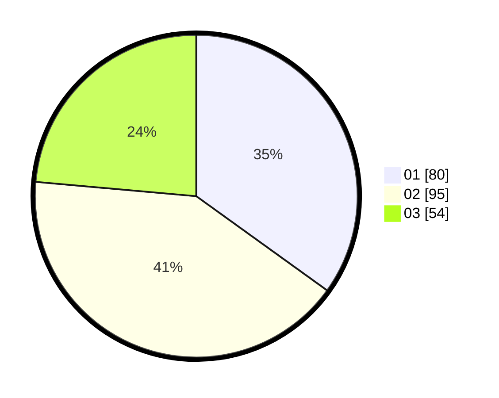

# Hasil

Hasil perolehan suara paslon dapat dilihat pada file paslon-01.txt, paslon-02.txt, dan paslon-03.txt.

Jika tidak ada, artinya data tersebut belum ada pada SIREKAP.

## Perolehan Suara

 * Paslon 01: **80**.
 * Paslon 02: **95**.
 * Paslon 03: **54**.

## Foto C Plano

https://sirekap-obj-formc.kpu.go.id/8351/pemilu/ppwp/31/75/08/10/01/3175081001115-20240214-231647--b992bc2c-1759-4f11-a7a5-3fb376d8247a.jpg

https://sirekap-obj-formc.kpu.go.id/8351/pemilu/ppwp/31/75/08/10/01/3175081001115-20240214-231755--db502cf7-57bd-4844-a013-bcaad42db97f.jpg

https://sirekap-obj-formc.kpu.go.id/8351/pemilu/ppwp/31/75/08/10/01/3175081001115-20240214-231903--06b191ce-b15c-4b93-99b0-f5c4a8bac8fd.jpg

## DATA PEMILIH TETAP

Jumlah pemilih dalam DPT: **273**.
 * L: **139**.
 * P: **134**.

## DATA PENGGUNA HAK PILIH

Jumlah pengguna hak pilih dalam DPT: **234**.
 * L: **115**.
 * P: **719**.

Jumlah pengguna hak pilih dalam DPTb: **1**.
 * L: **1**.
 * P: **0**.

Jumlah pengguna hak pilih dalam DPK: **0**.
 * L: **0**.
 * P: **0**.

Jumlah pengguna hak pilih: **235**.
 * L: **116**.
 * P: **119**.

## JUMLAH SUARA SAH DAN TIDAK SAH

JUMLAH SELURUH SUARA SAH: **229**.

JUMLAH SUARA TIDAK SAH: **6**.

JUMLAH SELURUH SUARA SAH DAN SUARA TIDAK SAH: **235**.
