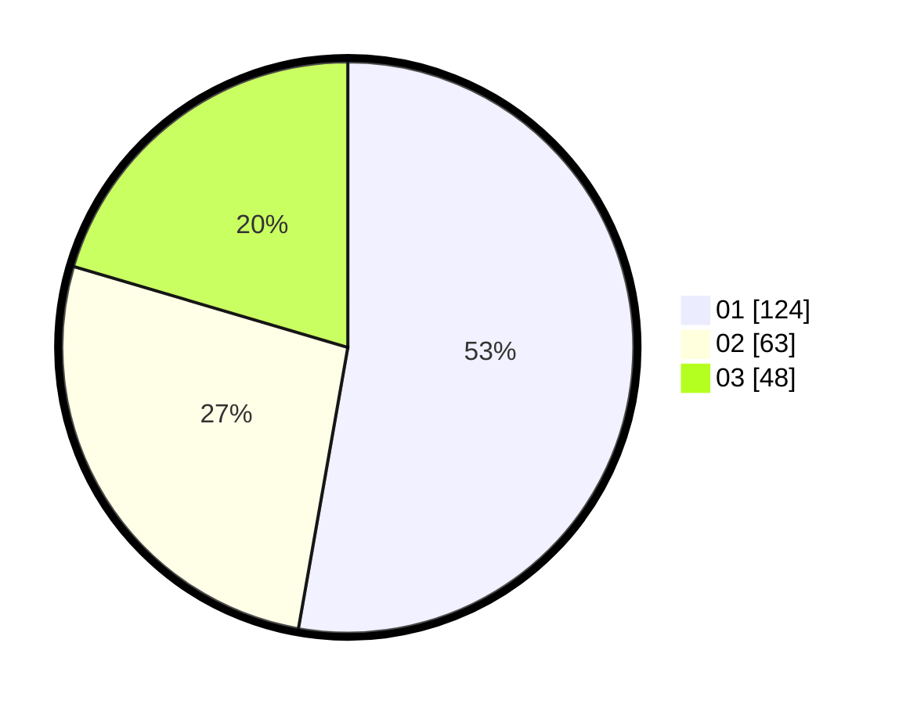

# Hasil

Hasil perolehan suara paslon dapat dilihat pada file paslon-01.txt, paslon-02.txt, dan paslon-03.txt.

Jika tidak ada, artinya data tersebut belum ada pada SIREKAP.

## Perolehan Suara

 * Paslon 01: **124**.
 * Paslon 02: **63**.
 * Paslon 03: **48**.

## Foto C Plano

https://sirekap-obj-formc.kpu.go.id/aef6/pemilu/ppwp/31/75/08/10/02/3175081002001-20240216-154036--4d8e13f0-d62a-4ac2-8271-c082625fcc3b.jpg

https://sirekap-obj-formc.kpu.go.id/aef6/pemilu/ppwp/31/75/08/10/02/3175081002001-20240216-154140--080d9fd5-4198-4aff-9e26-8b12a58413d7.jpg

https://sirekap-obj-formc.kpu.go.id/aef6/pemilu/ppwp/31/75/08/10/02/3175081002001-20240216-154234--b339806a-c612-4a69-83f9-d97cf425cd0b.jpg
