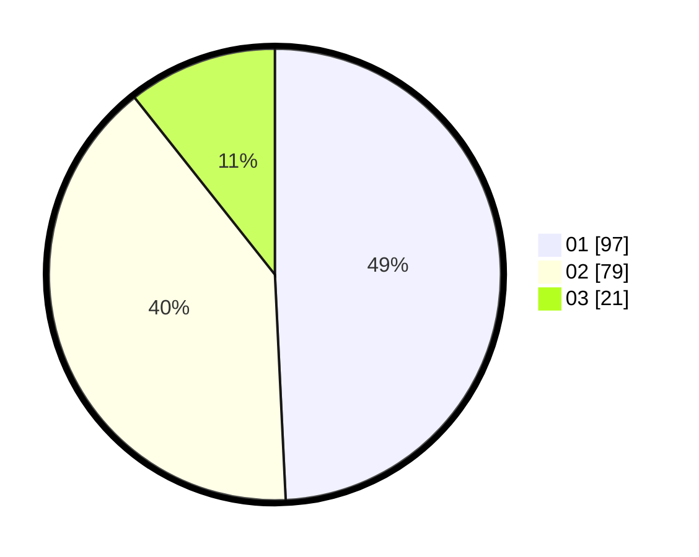

# Hasil

Hasil perolehan suara paslon dapat dilihat pada file paslon-01.txt, paslon-02.txt, dan paslon-03.txt.

Jika tidak ada, artinya data tersebut belum ada pada SIREKAP.

## Perolehan Suara

 * Paslon 01: **97**.
 * Paslon 02: **79**.
 * Paslon 03: **21**.

## Foto C Plano

https://sirekap-obj-formc.kpu.go.id/12e4/pemilu/ppwp/31/75/08/10/02/3175081002002-20240216-142718--23fc57c2-5f5d-4668-9506-c54413159558.jpg

https://sirekap-obj-formc.kpu.go.id/12e4/pemilu/ppwp/31/75/08/10/02/3175081002002-20240214-192656--e9867491-50da-412c-b749-bc37814abc2e.jpg

https://sirekap-obj-formc.kpu.go.id/12e4/pemilu/ppwp/31/75/08/10/02/3175081002002-20240216-143315--52ca691b-73d3-4850-b900-c75ccff8153f.jpg

## DATA PEMILIH TETAP

Jumlah pemilih dalam DPT: **260**.
 * L: **130**.
 * P: **130**.

## DATA PENGGUNA HAK PILIH

Jumlah pengguna hak pilih dalam DPT: **197**.
 * L: **94**.
 * P: **103**.

Jumlah pengguna hak pilih dalam DPTb: **3**.
 * L: **1**.
 * P: **2**.

Jumlah pengguna hak pilih dalam DPK: **1**.
 * L: **1**.
 * P: **0**.

Jumlah pengguna hak pilih: **201**.
 * L: **96**.
 * P: **105**.

## JUMLAH SUARA SAH DAN TIDAK SAH

JUMLAH SELURUH SUARA SAH: **197**.

JUMLAH SUARA TIDAK SAH: **4**.

JUMLAH SELURUH SUARA SAH DAN SUARA TIDAK SAH: **201**.
