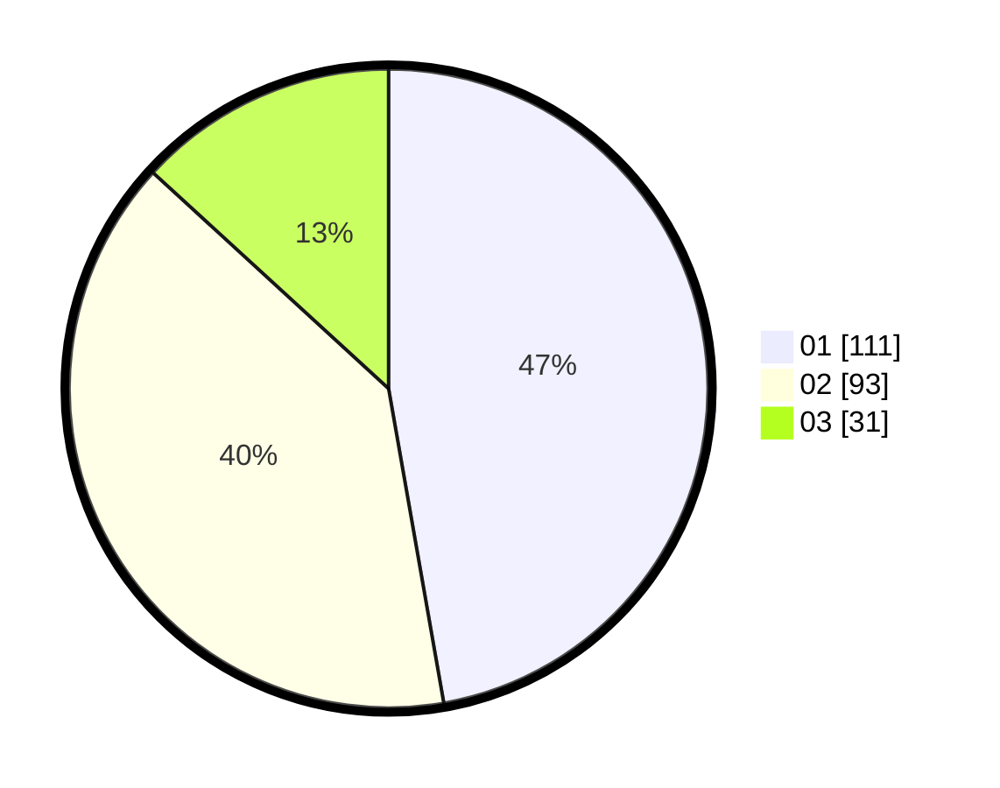

# Hasil

Hasil perolehan suara paslon dapat dilihat pada file paslon-01.txt, paslon-02.txt, dan paslon-03.txt.

Jika tidak ada, artinya data tersebut belum ada pada SIREKAP.

## Perolehan Suara

 * Paslon 01: **111**.
 * Paslon 02: **93**.
 * Paslon 03: **31**.

## Foto C Plano

https://sirekap-obj-formc.kpu.go.id/b6b0/pemilu/ppwp/31/75/08/10/02/3175081002005-20240214-202843--46c2e5bd-5948-4916-bc36-1c7ade281bac.jpg

https://sirekap-obj-formc.kpu.go.id/b6b0/pemilu/ppwp/31/75/08/10/02/3175081002005-20240214-203051--f4ed1682-669b-4228-8f82-5170f6fc3385.jpg

https://sirekap-obj-formc.kpu.go.id/b6b0/pemilu/ppwp/31/75/08/10/02/3175081002005-20240214-203144--a9360b4a-2d3c-4499-bcc0-047c93fea845.jpg
