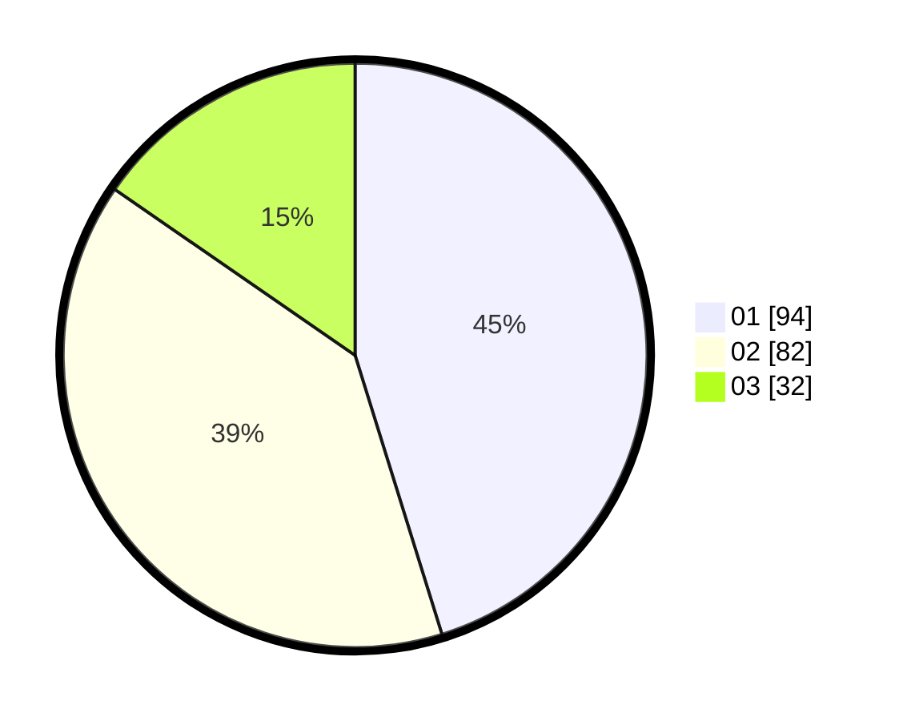

# Hasil

Hasil perolehan suara paslon dapat dilihat pada file paslon-01.txt, paslon-02.txt, dan paslon-03.txt.

Jika tidak ada, artinya data tersebut belum ada pada SIREKAP.

## Perolehan Suara

 * Paslon 01: **94**.
 * Paslon 02: **82**.
 * Paslon 03: **32**.

## Foto C Plano

https://sirekap-obj-formc.kpu.go.id/415d/pemilu/ppwp/31/75/08/10/02/3175081002006-20240214-212755--a07a6d04-fc72-476c-890f-c87a967b749d.jpg

https://sirekap-obj-formc.kpu.go.id/415d/pemilu/ppwp/31/75/08/10/02/3175081002006-20240215-000054--e4742081-b89a-49ee-af53-a4536266c702.jpg

https://sirekap-obj-formc.kpu.go.id/415d/pemilu/ppwp/31/75/08/10/02/3175081002006-20240214-213000--f5b1c40e-157c-4391-8177-e8c037bb68a1.jpg

## DATA PEMILIH TETAP

Jumlah pemilih dalam DPT: **265**.
 * L: **124**.
 * P: **141**.

## DATA PENGGUNA HAK PILIH

Jumlah pengguna hak pilih dalam DPT: **213**.
 * L: **99**.
 * P: **114**.

Jumlah pengguna hak pilih dalam DPTb: **1**.
 * L: **0**.
 * P: **1**.

Jumlah pengguna hak pilih dalam DPK: **0**.
 * L: **0**.
 * P: **0**.

Jumlah pengguna hak pilih: **214**.
 * L: **99**.
 * P: **115**.

## JUMLAH SUARA SAH DAN TIDAK SAH

JUMLAH SELURUH SUARA SAH: **208**.

JUMLAH SUARA TIDAK SAH: **6**.

JUMLAH SELURUH SUARA SAH DAN SUARA TIDAK SAH: **214**.
