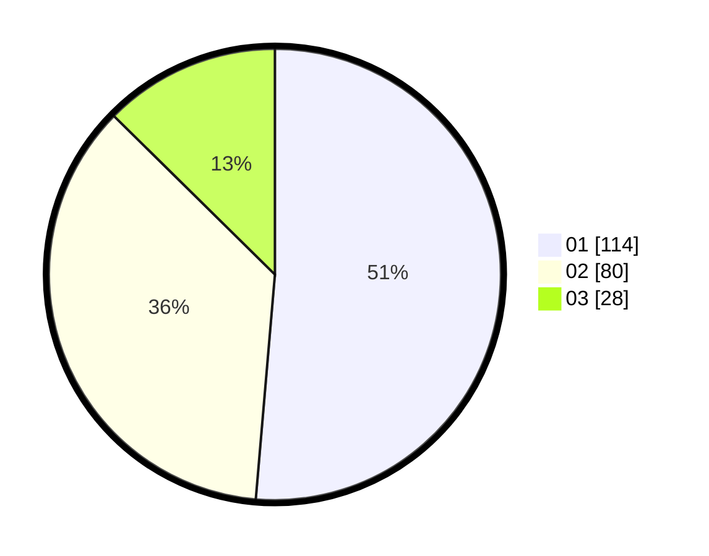

# Hasil

Hasil perolehan suara paslon dapat dilihat pada file paslon-01.txt, paslon-02.txt, dan paslon-03.txt.

Jika tidak ada, artinya data tersebut belum ada pada SIREKAP.

## Perolehan Suara

 * Paslon 01: **114**.
 * Paslon 02: **80**.
 * Paslon 03: **28**.

## Foto C Plano

https://sirekap-obj-formc.kpu.go.id/8a4d/pemilu/ppwp/31/75/08/10/02/3175081002008-20240214-215904--fa0460cc-3753-4c73-8e70-7eec0816f557.jpg

https://sirekap-obj-formc.kpu.go.id/8a4d/pemilu/ppwp/31/75/08/10/02/3175081002008-20240214-220001--8478e9f9-2f9c-4fbf-a4ac-dc9d84e4cd75.jpg

https://sirekap-obj-formc.kpu.go.id/8a4d/pemilu/ppwp/31/75/08/10/02/3175081002008-20240214-220200--54043547-0dcd-4aaa-b9af-3c13940ffc12.jpg
