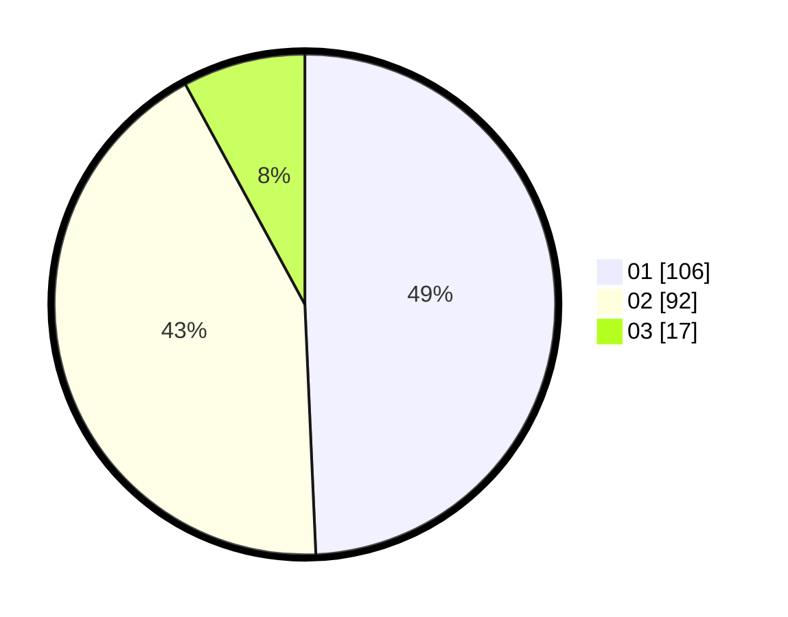

# Hasil

Hasil perolehan suara paslon dapat dilihat pada file paslon-01.txt, paslon-02.txt, dan paslon-03.txt.

Jika tidak ada, artinya data tersebut belum ada pada SIREKAP.

## Perolehan Suara

 * Paslon 01: **106**.
 * Paslon 02: **92**.
 * Paslon 03: **17**.

## Foto C Plano

https://sirekap-obj-formc.kpu.go.id/23e5/pemilu/ppwp/31/75/08/10/02/3175081002010-20240215-230623--a08ba457-8949-4bef-bee1-43b3b7bd0258.jpg

https://sirekap-obj-formc.kpu.go.id/23e5/pemilu/ppwp/31/75/08/10/02/3175081002010-20240215-231416--ae16e64a-b768-431f-8952-e6c269e6fe57.jpg

https://sirekap-obj-formc.kpu.go.id/23e5/pemilu/ppwp/31/75/08/10/02/3175081002010-20240215-232439--4a718c3b-c731-41dd-a868-42172fde7f57.jpg
