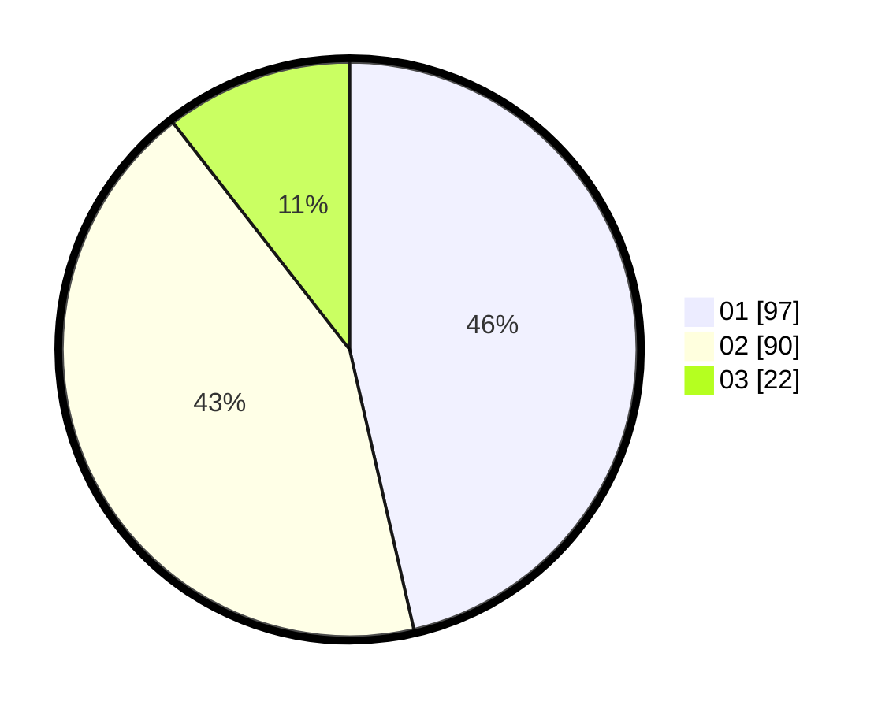

# Hasil

Hasil perolehan suara paslon dapat dilihat pada file paslon-01.txt, paslon-02.txt, dan paslon-03.txt.

Jika tidak ada, artinya data tersebut belum ada pada SIREKAP.

## Perolehan Suara

 * Paslon 01: **97**.
 * Paslon 02: **90**.
 * Paslon 03: **22**.

## Foto C Plano

https://sirekap-obj-formc.kpu.go.id/2e92/pemilu/ppwp/31/75/08/10/02/3175081002021-20240215-023507--4ddc6fbe-5b75-4b54-9306-914297bf1f71.jpg

https://sirekap-obj-formc.kpu.go.id/2e92/pemilu/ppwp/31/75/08/10/02/3175081002021-20240215-011028--a9c5c8d4-77bd-49e5-b825-84af6cb9eadc.jpg

https://sirekap-obj-formc.kpu.go.id/2e92/pemilu/ppwp/31/75/08/10/02/3175081002021-20240215-011431--2a2cbd8f-3b97-4593-8431-08a318dc730e.jpg
