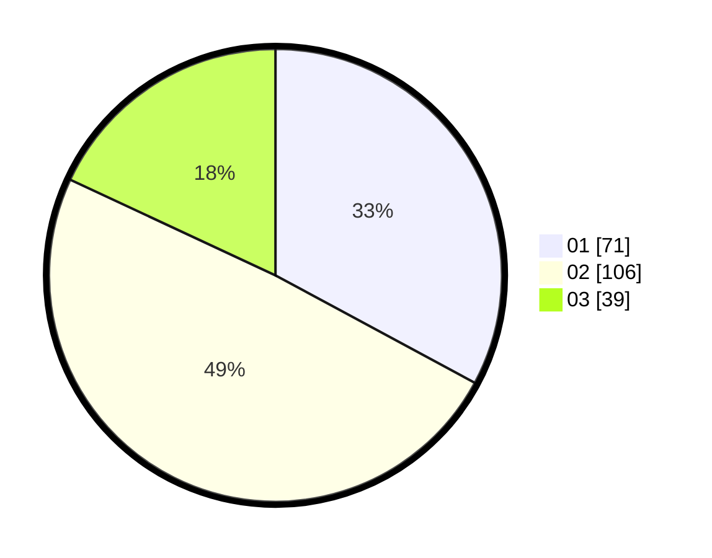

# Hasil

Hasil perolehan suara paslon dapat dilihat pada file paslon-01.txt, paslon-02.txt, dan paslon-03.txt.

Jika tidak ada, artinya data tersebut belum ada pada SIREKAP.

## Perolehan Suara

 * Paslon 01: **71**.
 * Paslon 02: **106**.
 * Paslon 03: **39**.

## Foto C Plano

https://sirekap-obj-formc.kpu.go.id/80dc/pemilu/ppwp/31/75/08/10/02/3175081002022-20240214-232637--228e1a00-8193-46b1-9b48-b44fd7e0ee78.jpg

https://sirekap-obj-formc.kpu.go.id/80dc/pemilu/ppwp/31/75/08/10/02/3175081002022-20240214-232806--5ae5aaaf-3868-49bb-b048-ec21de4e8bc3.jpg

https://sirekap-obj-formc.kpu.go.id/80dc/pemilu/ppwp/31/75/08/10/02/3175081002022-20240214-232925--e94d05d7-eaf7-4778-b10b-8f01276b1f52.jpg

## DATA PEMILIH TETAP

Jumlah pemilih dalam DPT: **268**.
 * L: **129**.
 * P: **139**.

## DATA PENGGUNA HAK PILIH

Jumlah pengguna hak pilih dalam DPT: **216**.
 * L: **102**.
 * P: **114**.

Jumlah pengguna hak pilih dalam DPTb: **3**.
 * L: **1**.
 * P: **2**.

Jumlah pengguna hak pilih dalam DPK: **0**.
 * L: **0**.
 * P: **0**.

Jumlah pengguna hak pilih: **219**.
 * L: **103**.
 * P: **116**.

## JUMLAH SUARA SAH DAN TIDAK SAH

JUMLAH SELURUH SUARA SAH: **216**.

JUMLAH SUARA TIDAK SAH: **3**.

JUMLAH SELURUH SUARA SAH DAN SUARA TIDAK SAH: **219**.
