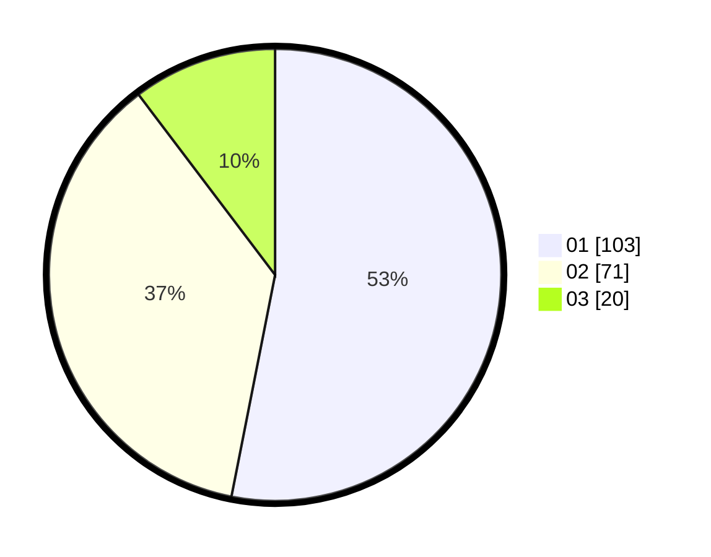

# Hasil

Hasil perolehan suara paslon dapat dilihat pada file paslon-01.txt, paslon-02.txt, dan paslon-03.txt.

Jika tidak ada, artinya data tersebut belum ada pada SIREKAP.

## Perolehan Suara

 * Paslon 01: **103**.
 * Paslon 02: **71**.
 * Paslon 03: **20**.

## Foto C Plano

https://sirekap-obj-formc.kpu.go.id/4d8a/pemilu/ppwp/31/75/08/10/02/3175081002024-20240214-224454--b0b7db30-7d63-43e3-a143-026ac6d62cd8.jpg

https://sirekap-obj-formc.kpu.go.id/4d8a/pemilu/ppwp/31/75/08/10/02/3175081002024-20240214-224733--a4996d52-6433-4d4d-b509-a04da054bb30.jpg

https://sirekap-obj-formc.kpu.go.id/4d8a/pemilu/ppwp/31/75/08/10/02/3175081002024-20240214-224824--477283bc-b437-48c6-beba-bc8d7dd87cff.jpg

## DATA PEMILIH TETAP

Jumlah pemilih dalam DPT: **271**.
 * L: **122**.
 * P: **149**.

## DATA PENGGUNA HAK PILIH

Jumlah pengguna hak pilih dalam DPT: **198**.
 * L: **84**.
 * P: **114**.

Jumlah pengguna hak pilih dalam DPTb: **0**.
 * L: **0**.
 * P: **0**.

Jumlah pengguna hak pilih dalam DPK: **1**.
 * L: **0**.
 * P: **1**.

Jumlah pengguna hak pilih: **199**.
 * L: **84**.
 * P: **115**.

## JUMLAH SUARA SAH DAN TIDAK SAH

JUMLAH SELURUH SUARA SAH: **194**.

JUMLAH SUARA TIDAK SAH: **5**.

JUMLAH SELURUH SUARA SAH DAN SUARA TIDAK SAH: **199**.
