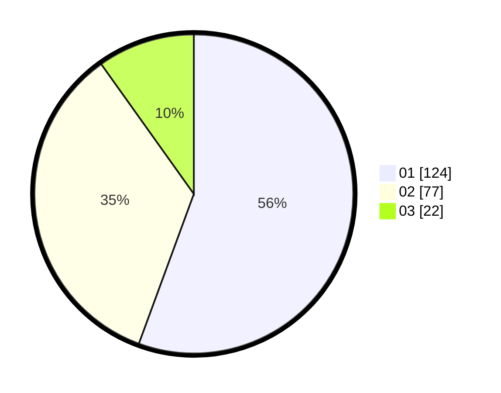

# Hasil

Hasil perolehan suara paslon dapat dilihat pada file paslon-01.txt, paslon-02.txt, dan paslon-03.txt.

Jika tidak ada, artinya data tersebut belum ada pada SIREKAP.

## Perolehan Suara

 * Paslon 01: **124**.
 * Paslon 02: **77**.
 * Paslon 03: **22**.

## Foto C Plano

https://sirekap-obj-formc.kpu.go.id/d308/pemilu/ppwp/31/75/08/10/02/3175081002027-20240215-010437--321b8ffe-3d5d-4a9c-8696-3178bae99a0f.jpg

https://sirekap-obj-formc.kpu.go.id/d308/pemilu/ppwp/31/75/08/10/02/3175081002027-20240215-010524--da253ca7-8d24-4ba9-aef7-484b85954b9b.jpg

https://sirekap-obj-formc.kpu.go.id/d308/pemilu/ppwp/31/75/08/10/02/3175081002027-20240214-233617--f533c5d2-41af-4240-a665-1cb5f2b99e20.jpg
