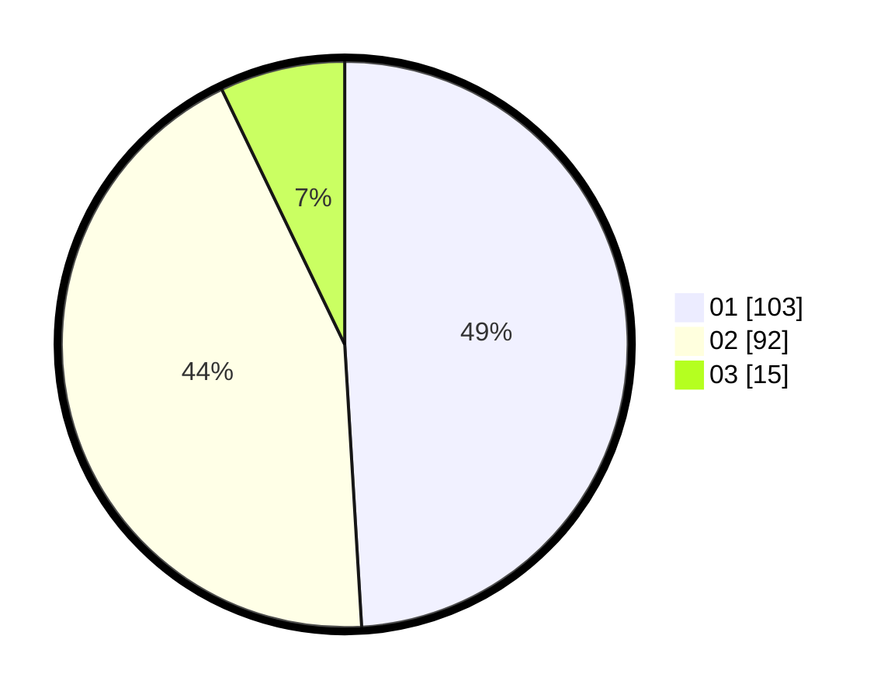

# Hasil

Hasil perolehan suara paslon dapat dilihat pada file paslon-01.txt, paslon-02.txt, dan paslon-03.txt.

Jika tidak ada, artinya data tersebut belum ada pada SIREKAP.

## Perolehan Suara

 * Paslon 01: **103**.
 * Paslon 02: **92**.
 * Paslon 03: **15**.

## Foto C Plano

https://sirekap-obj-formc.kpu.go.id/8c8c/pemilu/ppwp/31/75/08/10/02/3175081002029-20240215-003231--af9930a0-1820-4bd9-bb1b-66f06cf60e17.jpg

https://sirekap-obj-formc.kpu.go.id/8c8c/pemilu/ppwp/31/75/08/10/02/3175081002029-20240215-003348--81d6335a-1931-4643-b547-e3bc1f5e2f2d.jpg

https://sirekap-obj-formc.kpu.go.id/8c8c/pemilu/ppwp/31/75/08/10/02/3175081002029-20240215-020803--4d6c9a95-c199-4f80-9b4a-9177dc622e47.jpg
