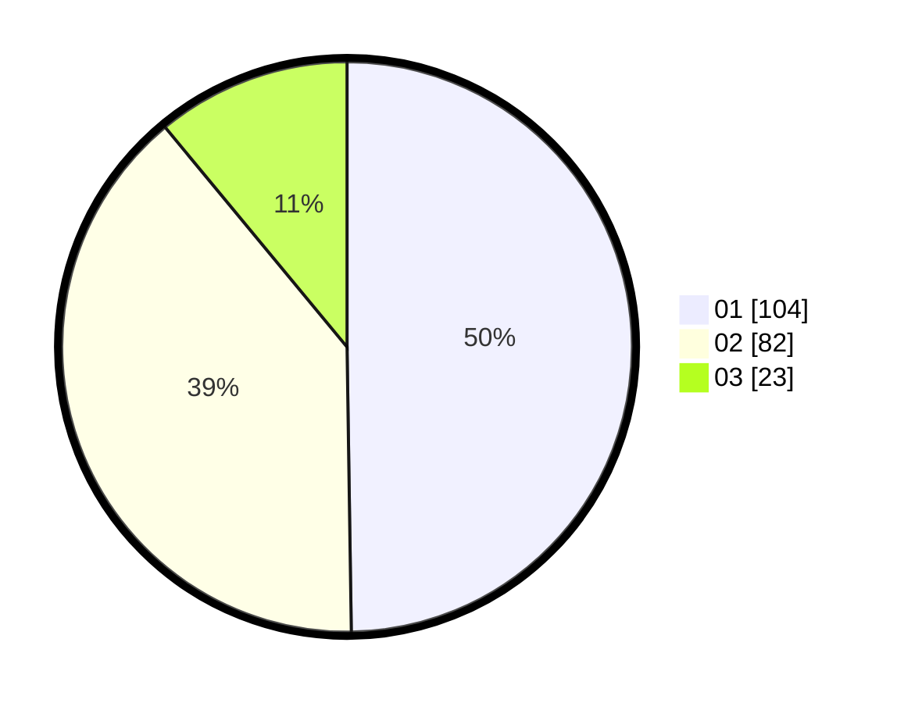

# Hasil

Hasil perolehan suara paslon dapat dilihat pada file paslon-01.txt, paslon-02.txt, dan paslon-03.txt.

Jika tidak ada, artinya data tersebut belum ada pada SIREKAP.

## Perolehan Suara

 * Paslon 01: **104**.
 * Paslon 02: **82**.
 * Paslon 03: **23**.

## Foto C Plano

https://sirekap-obj-formc.kpu.go.id/b64d/pemilu/ppwp/31/75/08/10/02/3175081002031-20240214-223833--063a2db8-199d-4968-9bc2-6c93e6572b5a.jpg

https://sirekap-obj-formc.kpu.go.id/b64d/pemilu/ppwp/31/75/08/10/02/3175081002031-20240214-224144--0a7c8c73-e14a-4f99-8df0-ff23df102021.jpg

https://sirekap-obj-formc.kpu.go.id/b64d/pemilu/ppwp/31/75/08/10/02/3175081002031-20240214-224551--51255b0f-53b8-40d1-ad15-48af2b11e3f7.jpg
