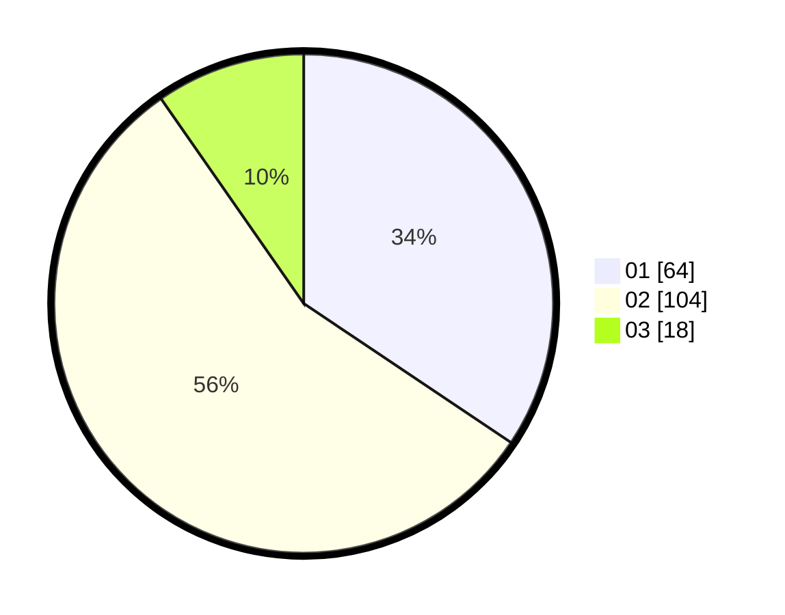

# Hasil

Hasil perolehan suara paslon dapat dilihat pada file paslon-01.txt, paslon-02.txt, dan paslon-03.txt.

Jika tidak ada, artinya data tersebut belum ada pada SIREKAP.

## Perolehan Suara

 * Paslon 01: **64**.
 * Paslon 02: **104**.
 * Paslon 03: **18**.

## Foto C Plano

https://sirekap-obj-formc.kpu.go.id/0d8b/pemilu/ppwp/31/75/08/10/02/3175081002033-20240214-213546--50ca8b7d-6528-4db5-80da-6e4039ffa1c2.jpg

https://sirekap-obj-formc.kpu.go.id/0d8b/pemilu/ppwp/31/75/08/10/02/3175081002033-20240214-213953--21e1fdb5-7cdc-4a25-a726-e6c106466e87.jpg

https://sirekap-obj-formc.kpu.go.id/0d8b/pemilu/ppwp/31/75/08/10/02/3175081002033-20240214-214121--336bca60-084b-4ff2-9d2f-d40e7b090c2a.jpg
