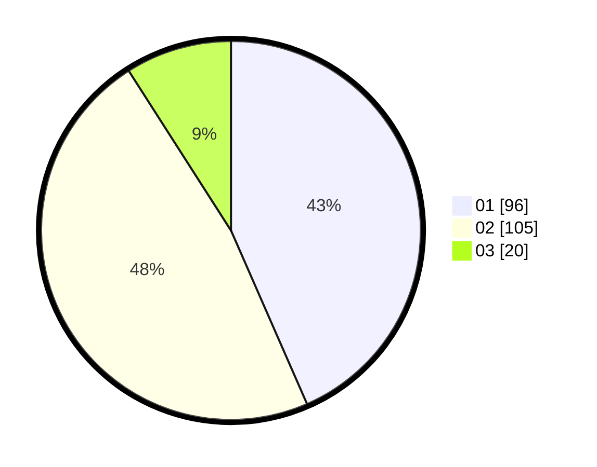

# Hasil

Hasil perolehan suara paslon dapat dilihat pada file paslon-01.txt, paslon-02.txt, dan paslon-03.txt.

Jika tidak ada, artinya data tersebut belum ada pada SIREKAP.

## Perolehan Suara

 * Paslon 01: **96**.
 * Paslon 02: **105**.
 * Paslon 03: **20**.

## Foto C Plano

https://sirekap-obj-formc.kpu.go.id/f2a4/pemilu/ppwp/31/75/08/10/02/3175081002034-20240214-213115--6f5f087d-f40e-4188-8fef-3949bf3dfe43.jpg

https://sirekap-obj-formc.kpu.go.id/f2a4/pemilu/ppwp/31/75/08/10/02/3175081002034-20240214-213313--761ece2f-8460-4830-b067-d122daa27c44.jpg
