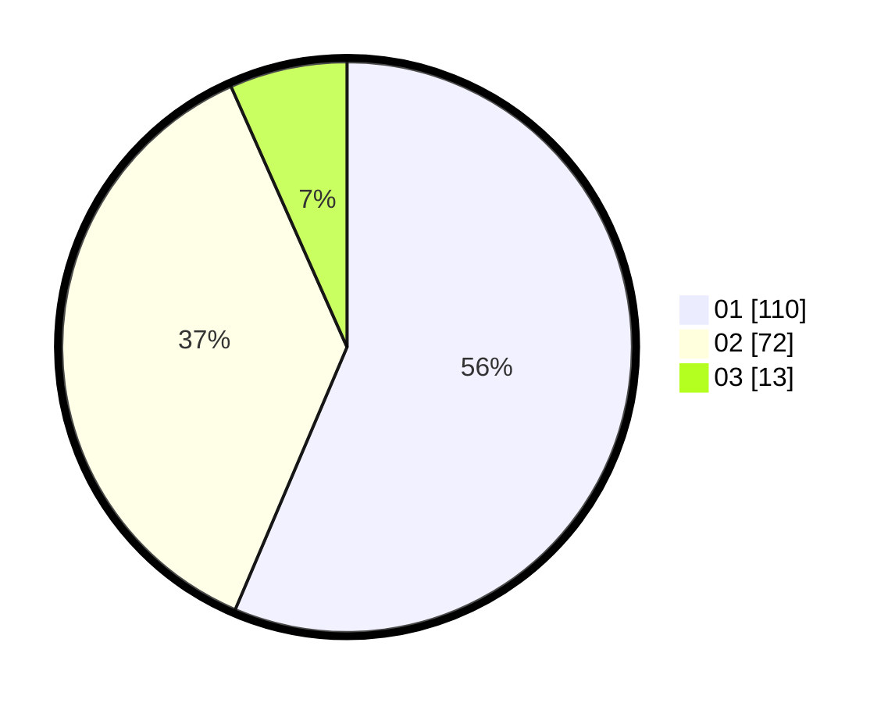

# Hasil

Hasil perolehan suara paslon dapat dilihat pada file paslon-01.txt, paslon-02.txt, dan paslon-03.txt.

Jika tidak ada, artinya data tersebut belum ada pada SIREKAP.

## Perolehan Suara

 * Paslon 01: **110**.
 * Paslon 02: **72**.
 * Paslon 03: **13**.

## Foto C Plano

https://sirekap-obj-formc.kpu.go.id/b2e0/pemilu/ppwp/31/75/08/10/02/3175081002037-20240216-063709--b2774919-188a-4b78-b829-1f9a7c0322eb.jpg

https://sirekap-obj-formc.kpu.go.id/b2e0/pemilu/ppwp/31/75/08/10/02/3175081002037-20240216-063710--1752a7df-b7c8-4d36-8ff2-35ed10d5882f.jpg

https://sirekap-obj-formc.kpu.go.id/b2e0/pemilu/ppwp/31/75/08/10/02/3175081002037-20240216-063709--9b0a0165-6d0c-4b18-b26e-29d446be8e37.jpg

## DATA PEMILIH TETAP

Jumlah pemilih dalam DPT: **274**.
 * L: **131**.
 * P: **143**.

## DATA PENGGUNA HAK PILIH

Jumlah pengguna hak pilih dalam DPT: **198**.
 * L: **88**.
 * P: **110**.

Jumlah pengguna hak pilih dalam DPTb: **0**.
 * L: **0**.
 * P: **0**.

Jumlah pengguna hak pilih dalam DPK: **0**.
 * L: **0**.
 * P: **0**.

Jumlah pengguna hak pilih: **198**.
 * L: **88**.
 * P: **110**.

## JUMLAH SUARA SAH DAN TIDAK SAH

JUMLAH SELURUH SUARA SAH: **195**.

JUMLAH SUARA TIDAK SAH: **3**.

JUMLAH SELURUH SUARA SAH DAN SUARA TIDAK SAH: **198**.
