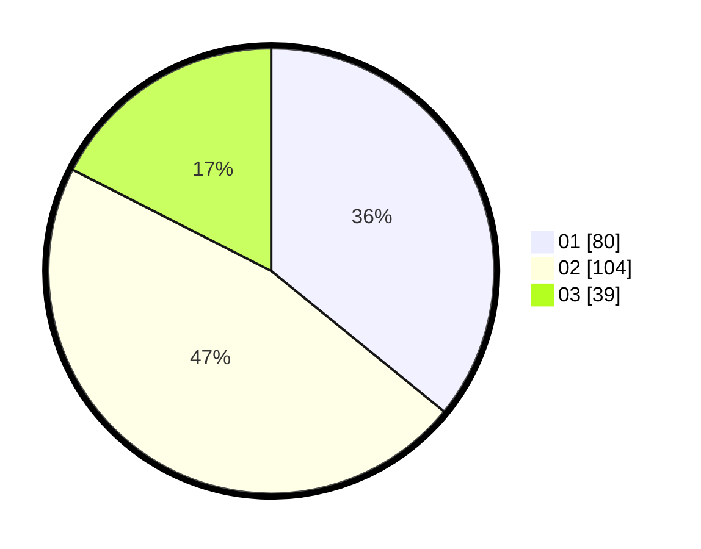

# Hasil

Hasil perolehan suara paslon dapat dilihat pada file paslon-01.txt, paslon-02.txt, dan paslon-03.txt.

Jika tidak ada, artinya data tersebut belum ada pada SIREKAP.

## Perolehan Suara

 * Paslon 01: **80**.
 * Paslon 02: **104**.
 * Paslon 03: **39**.

## Foto C Plano

https://sirekap-obj-formc.kpu.go.id/af9c/pemilu/ppwp/31/75/08/10/02/3175081002039-20240214-193420--d9fe961c-abf9-456b-976e-871e22fcabc4.jpg

https://sirekap-obj-formc.kpu.go.id/af9c/pemilu/ppwp/31/75/08/10/02/3175081002039-20240214-193513--37ff5c98-31db-4354-b517-47d5a5e800c5.jpg

https://sirekap-obj-formc.kpu.go.id/af9c/pemilu/ppwp/31/75/08/10/02/3175081002039-20240214-201647--031f0473-645a-4597-bb7f-4bdf4e3093c2.jpg
