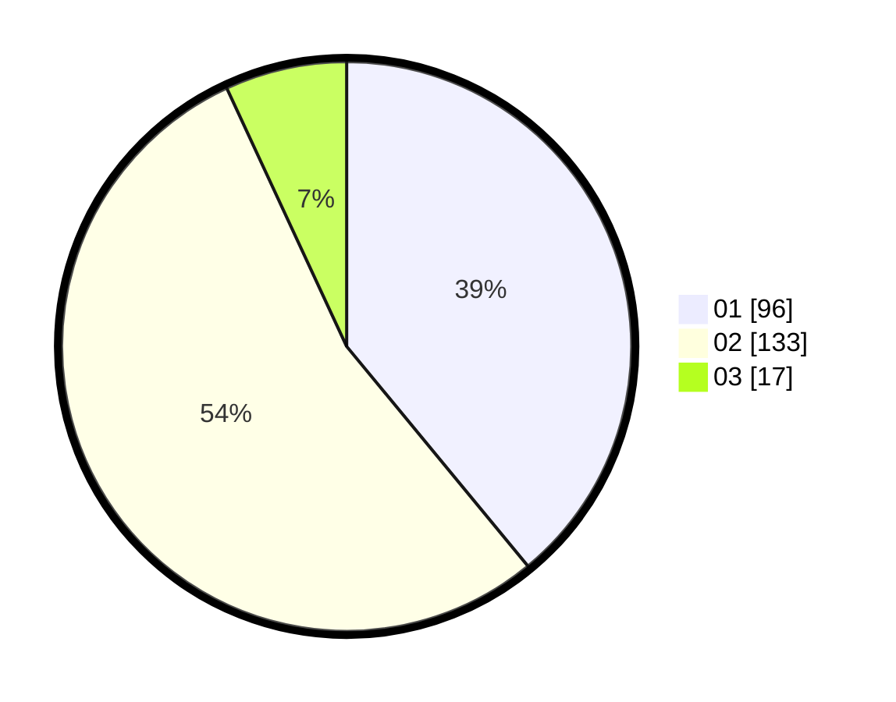

# Hasil

Hasil perolehan suara paslon dapat dilihat pada file paslon-01.txt, paslon-02.txt, dan paslon-03.txt.

Jika tidak ada, artinya data tersebut belum ada pada SIREKAP.

## Perolehan Suara

 * Paslon 01: **96**.
 * Paslon 02: **133**.
 * Paslon 03: **17**.

## Foto C Plano

https://sirekap-obj-formc.kpu.go.id/9086/pemilu/ppwp/31/75/08/10/02/3175081002041-20240215-013439--3556a4cb-2ebf-43ae-8a71-765239e21954.jpg

https://sirekap-obj-formc.kpu.go.id/9086/pemilu/ppwp/31/75/08/10/02/3175081002041-20240215-015720--a71a4684-2003-4bf9-8cb5-a64fb8683b80.jpg

https://sirekap-obj-formc.kpu.go.id/9086/pemilu/ppwp/31/75/08/10/02/3175081002041-20240216-124924--9068327d-235e-42b5-ba1e-099c30e903ac.jpg
