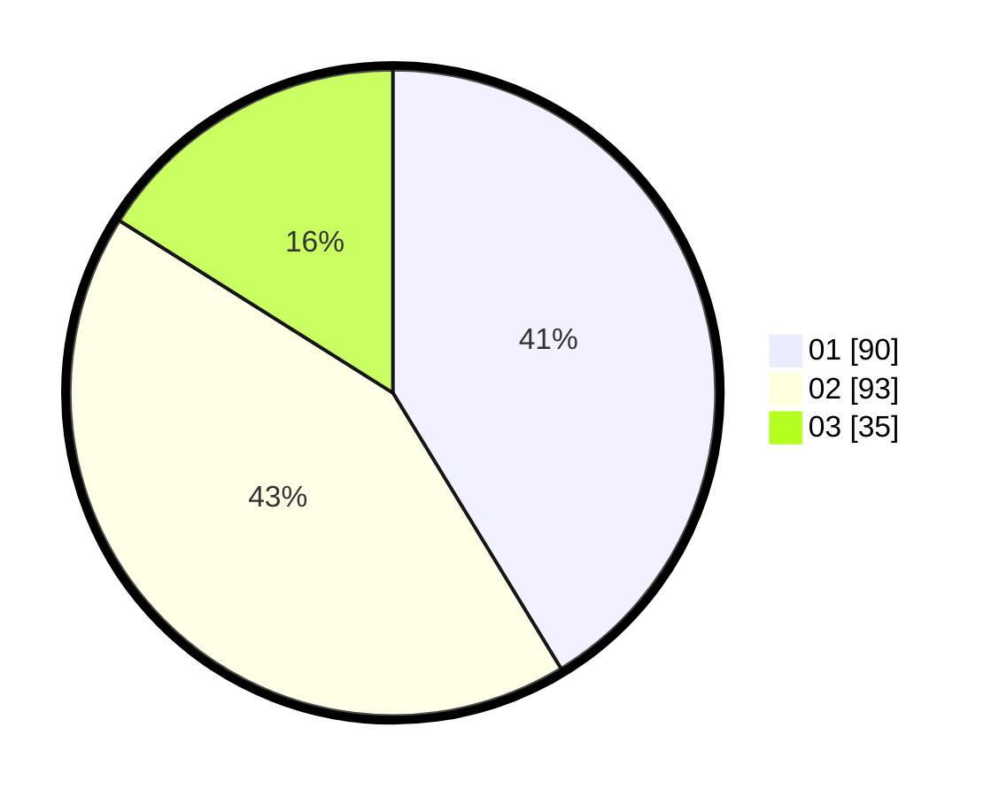

# Hasil

Hasil perolehan suara paslon dapat dilihat pada file paslon-01.txt, paslon-02.txt, dan paslon-03.txt.

Jika tidak ada, artinya data tersebut belum ada pada SIREKAP.

## Perolehan Suara

 * Paslon 01: **90**.
 * Paslon 02: **93**.
 * Paslon 03: **35**.

## Foto C Plano

https://sirekap-obj-formc.kpu.go.id/af2e/pemilu/ppwp/31/75/08/10/02/3175081002042-20240214-200059--8d9d9d5a-f3ec-466c-8df2-804b5273b967.jpg

https://sirekap-obj-formc.kpu.go.id/af2e/pemilu/ppwp/31/75/08/10/02/3175081002042-20240214-192225--6790649d-c218-4715-a7bb-5400f2e41d6f.jpg

https://sirekap-obj-formc.kpu.go.id/af2e/pemilu/ppwp/31/75/08/10/02/3175081002042-20240214-192108--b3c75da0-9944-4119-8ea2-233956fc0dbc.jpg

## DATA PEMILIH TETAP

Jumlah pemilih dalam DPT: **275**.
 * L: **138**.
 * P: **137**.

## DATA PENGGUNA HAK PILIH

Jumlah pengguna hak pilih dalam DPT: **209**.
 * L: **102**.
 * P: **107**.

Jumlah pengguna hak pilih dalam DPTb: **3**.
 * L: **0**.
 * P: **3**.

Jumlah pengguna hak pilih dalam DPK: **9**.
 * L: **5**.
 * P: **4**.

Jumlah pengguna hak pilih: **221**.
 * L: **107**.
 * P: **114**.

## JUMLAH SUARA SAH DAN TIDAK SAH

JUMLAH SELURUH SUARA SAH: **218**.

JUMLAH SUARA TIDAK SAH: **3**.

JUMLAH SELURUH SUARA SAH DAN SUARA TIDAK SAH: **221**.
