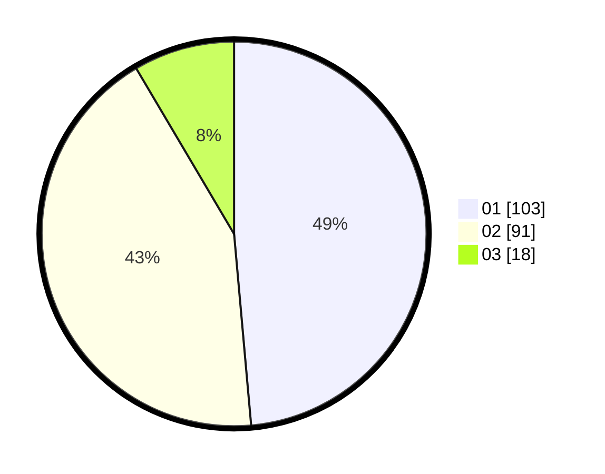

# Hasil

Hasil perolehan suara paslon dapat dilihat pada file paslon-01.txt, paslon-02.txt, dan paslon-03.txt.

Jika tidak ada, artinya data tersebut belum ada pada SIREKAP.

## Perolehan Suara

 * Paslon 01: **103**.
 * Paslon 02: **91**.
 * Paslon 03: **18**.

## Foto C Plano

https://sirekap-obj-formc.kpu.go.id/ef0f/pemilu/ppwp/31/75/08/10/02/3175081002044-20240215-225739--11551c5f-886b-4e94-a7aa-fdddb7a52b70.jpg

https://sirekap-obj-formc.kpu.go.id/ef0f/pemilu/ppwp/31/75/08/10/02/3175081002044-20240216-140738--56ee3ecd-c217-439b-a87b-b30324b1533a.jpg

https://sirekap-obj-formc.kpu.go.id/ef0f/pemilu/ppwp/31/75/08/10/02/3175081002044-20240215-225740--cb1b444e-08f2-4318-81a5-b31dcbf5672c.jpg

## DATA PEMILIH TETAP

Jumlah pemilih dalam DPT: **270**.
 * L: **135**.
 * P: **135**.

## DATA PENGGUNA HAK PILIH

Jumlah pengguna hak pilih dalam DPT: **214**.
 * L: **106**.
 * P: **108**.

Jumlah pengguna hak pilih dalam DPTb: **0**.
 * L: **0**.
 * P: **0**.

Jumlah pengguna hak pilih dalam DPK: **0**.
 * L: **0**.
 * P: **0**.

Jumlah pengguna hak pilih: **214**.
 * L: **106**.
 * P: **108**.

## JUMLAH SUARA SAH DAN TIDAK SAH

JUMLAH SELURUH SUARA SAH: **212**.

JUMLAH SUARA TIDAK SAH: **2**.

JUMLAH SELURUH SUARA SAH DAN SUARA TIDAK SAH: **214**.
