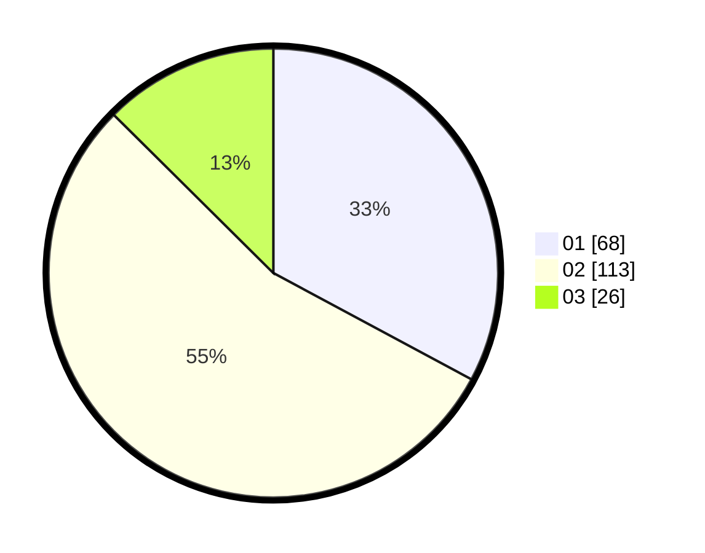

# Hasil

Hasil perolehan suara paslon dapat dilihat pada file paslon-01.txt, paslon-02.txt, dan paslon-03.txt.

Jika tidak ada, artinya data tersebut belum ada pada SIREKAP.

## Perolehan Suara

 * Paslon 01: **68**.
 * Paslon 02: **113**.
 * Paslon 03: **26**.

## Foto C Plano

https://sirekap-obj-formc.kpu.go.id/721c/pemilu/ppwp/31/75/08/10/02/3175081002045-20240214-232955--c8d7341f-91f4-4753-820b-f433836317e8.jpg

https://sirekap-obj-formc.kpu.go.id/721c/pemilu/ppwp/31/75/08/10/02/3175081002045-20240214-232943--339d0fd1-d042-476d-91dc-eb8dfc6b7a34.jpg

https://sirekap-obj-formc.kpu.go.id/721c/pemilu/ppwp/31/75/08/10/02/3175081002045-20240214-233020--d061dbf4-ffb5-485b-96bb-8a51989289e8.jpg
