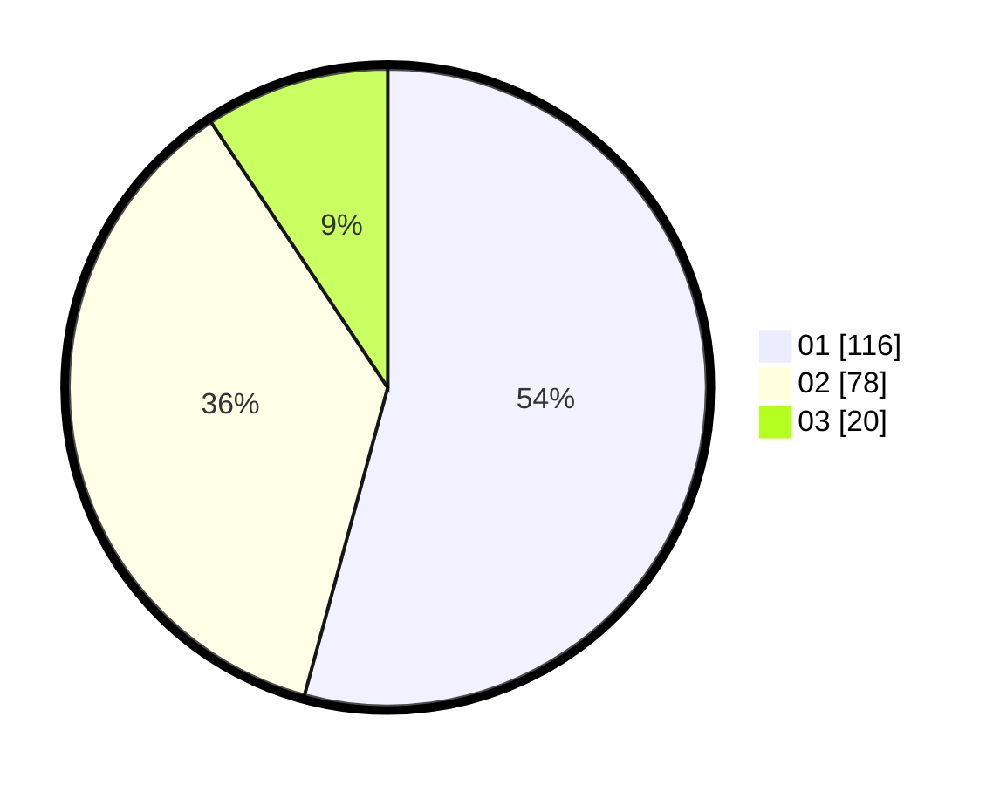

# Hasil

Hasil perolehan suara paslon dapat dilihat pada file paslon-01.txt, paslon-02.txt, dan paslon-03.txt.

Jika tidak ada, artinya data tersebut belum ada pada SIREKAP.

## Perolehan Suara

 * Paslon 01: **116**.
 * Paslon 02: **78**.
 * Paslon 03: **20**.

## Foto C Plano

https://sirekap-obj-formc.kpu.go.id/ed53/pemilu/ppwp/31/75/08/10/02/3175081002049-20240216-143321--ef49ed0c-ecce-465b-be08-9874cf6926f0.jpg

https://sirekap-obj-formc.kpu.go.id/ed53/pemilu/ppwp/31/75/08/10/02/3175081002049-20240216-144003--c97d19c6-9392-4fb3-bf91-54653cef5f3b.jpg

https://sirekap-obj-formc.kpu.go.id/ed53/pemilu/ppwp/31/75/08/10/02/3175081002049-20240216-144511--5b3c483b-cad2-4ccc-9dc8-0c2922f115d7.jpg

## DATA PEMILIH TETAP

Jumlah pemilih dalam DPT: **266**.
 * L: **128**.
 * P: **138**.

## DATA PENGGUNA HAK PILIH

Jumlah pengguna hak pilih dalam DPT: **206**.
 * L: **99**.
 * P: **107**.

Jumlah pengguna hak pilih dalam DPTb: **3**.
 * L: **1**.
 * P: **2**.

Jumlah pengguna hak pilih dalam DPK: **5**.
 * L: **1**.
 * P: **4**.

Jumlah pengguna hak pilih: **214**.
 * L: **101**.
 * P: **113**.

## JUMLAH SUARA SAH DAN TIDAK SAH

JUMLAH SELURUH SUARA SAH: **214**.

JUMLAH SUARA TIDAK SAH: **0**.

JUMLAH SELURUH SUARA SAH DAN SUARA TIDAK SAH: **214**.
