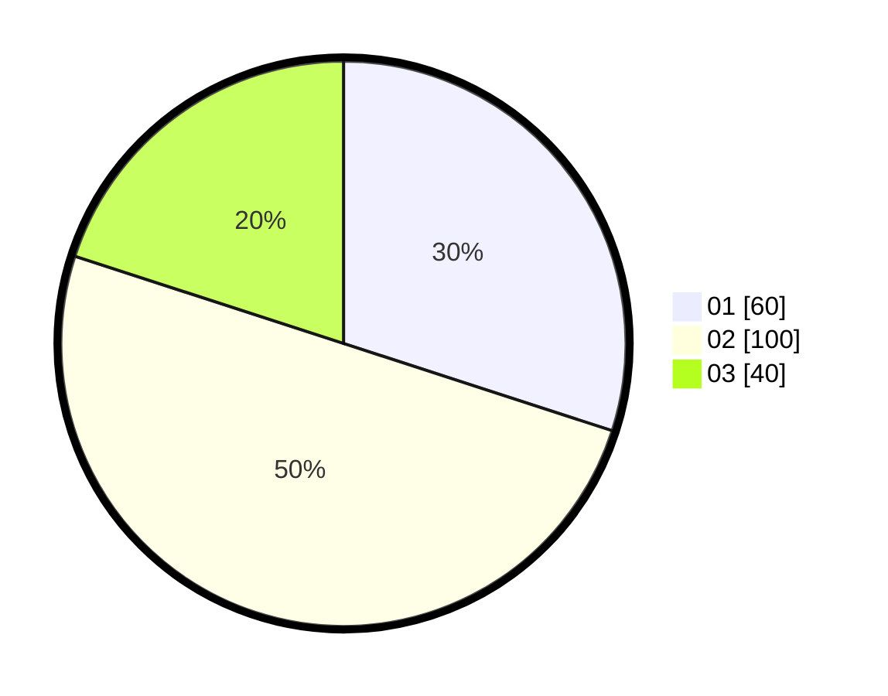

# Hasil

Hasil perolehan suara paslon dapat dilihat pada file paslon-01.txt, paslon-02.txt, dan paslon-03.txt.

Jika tidak ada, artinya data tersebut belum ada pada SIREKAP.

## Perolehan Suara

 * Paslon 01: **60**.
 * Paslon 02: **100**.
 * Paslon 03: **40**.

## Foto C Plano

https://sirekap-obj-formc.kpu.go.id/39aa/pemilu/ppwp/31/75/08/10/02/3175081002052-20240214-225020--ba62b052-f923-4f23-aafc-b7e3cea1ebc2.jpg

https://sirekap-obj-formc.kpu.go.id/39aa/pemilu/ppwp/31/75/08/10/02/3175081002052-20240214-225509--d9eb7e4f-18e3-48a0-9cf8-c7a61afb25bf.jpg

https://sirekap-obj-formc.kpu.go.id/39aa/pemilu/ppwp/31/75/08/10/02/3175081002052-20240214-225642--3c80fa6e-16dc-4340-9e46-3d9093f7b4b8.jpg
