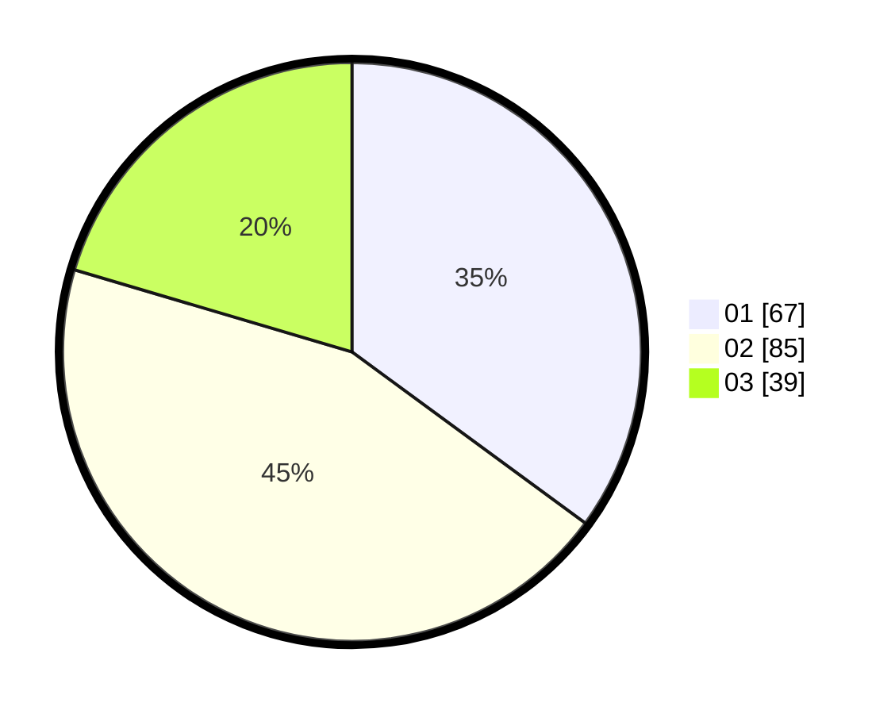

# Hasil

Hasil perolehan suara paslon dapat dilihat pada file paslon-01.txt, paslon-02.txt, dan paslon-03.txt.

Jika tidak ada, artinya data tersebut belum ada pada SIREKAP.

## Perolehan Suara

 * Paslon 01: **67**.
 * Paslon 02: **85**.
 * Paslon 03: **39**.

## Foto C Plano

https://sirekap-obj-formc.kpu.go.id/d05a/pemilu/ppwp/31/75/08/10/02/3175081002054-20240214-232003--3df8ae0c-6b2d-4cc2-80e8-01fe326a9ae9.jpg

https://sirekap-obj-formc.kpu.go.id/d05a/pemilu/ppwp/31/75/08/10/02/3175081002054-20240214-232216--a3883f70-720d-45a9-9de3-8fdc8835781d.jpg
