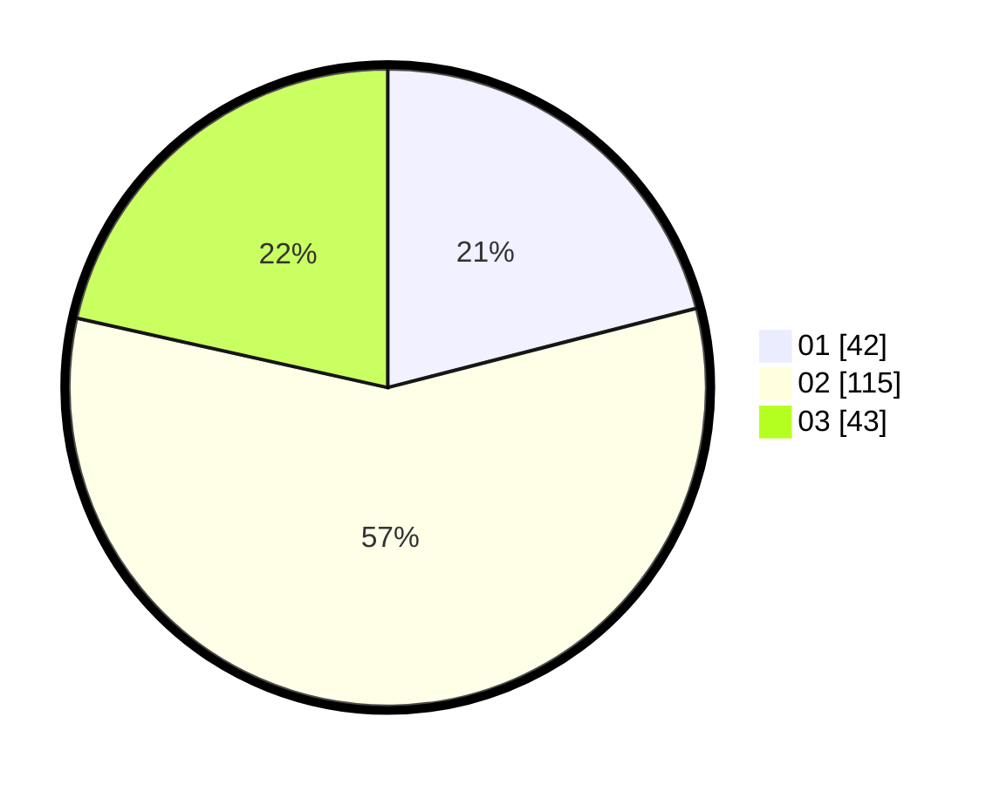

# Hasil

Hasil perolehan suara paslon dapat dilihat pada file paslon-01.txt, paslon-02.txt, dan paslon-03.txt.

Jika tidak ada, artinya data tersebut belum ada pada SIREKAP.

## Perolehan Suara

 * Paslon 01: **42**.
 * Paslon 02: **115**.
 * Paslon 03: **43**.

## Foto C Plano

https://sirekap-obj-formc.kpu.go.id/5357/pemilu/ppwp/31/75/08/10/02/3175081002056-20240214-225913--a478422b-72aa-49a0-9eae-50808237cfca.jpg

https://sirekap-obj-formc.kpu.go.id/5357/pemilu/ppwp/31/75/08/10/02/3175081002056-20240214-230005--1d43ee5d-2686-4212-9781-54f505d61f0d.jpg

https://sirekap-obj-formc.kpu.go.id/5357/pemilu/ppwp/31/75/08/10/02/3175081002056-20240214-230108--5919232e-039e-4077-be90-73e406c0f184.jpg
