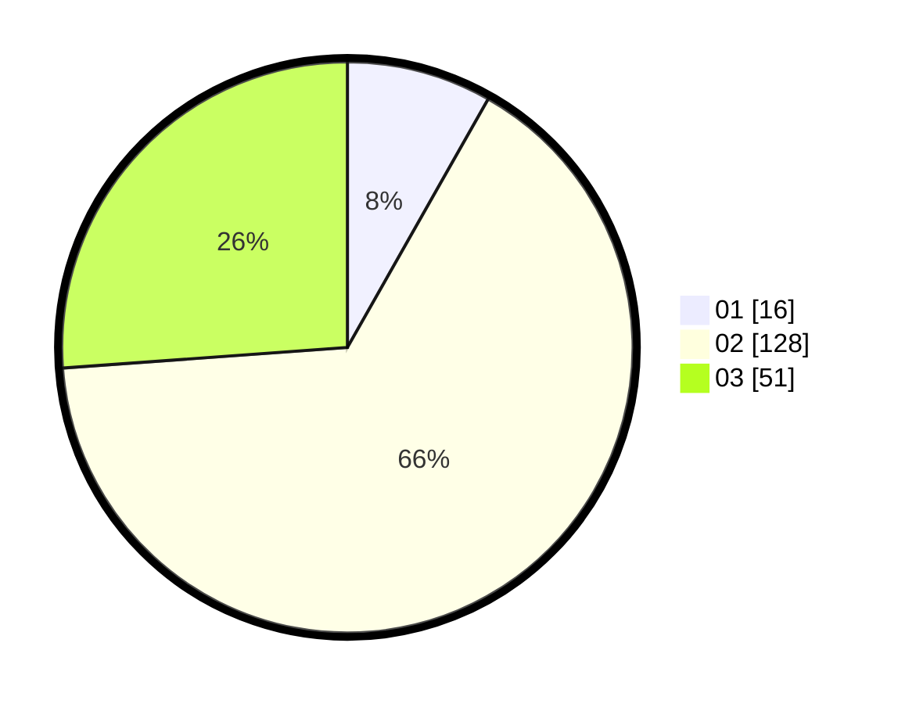

# Hasil

Hasil perolehan suara paslon dapat dilihat pada file paslon-01.txt, paslon-02.txt, dan paslon-03.txt.

Jika tidak ada, artinya data tersebut belum ada pada SIREKAP.

## Perolehan Suara

 * Paslon 01: **16**.
 * Paslon 02: **128**.
 * Paslon 03: **51**.

## Foto C Plano

https://sirekap-obj-formc.kpu.go.id/922a/pemilu/ppwp/31/75/08/10/02/3175081002060-20240214-184847--712a26e4-abee-4f94-8a1a-51e688dbb69f.jpg

https://sirekap-obj-formc.kpu.go.id/922a/pemilu/ppwp/31/75/08/10/02/3175081002060-20240214-185043--ad4fccf9-519d-4dda-841e-8611e7e0bc6e.jpg

https://sirekap-obj-formc.kpu.go.id/922a/pemilu/ppwp/31/75/08/10/02/3175081002060-20240214-185134--4490a775-f7e9-437b-8e5e-d1933640d647.jpg

## DATA PEMILIH TETAP

Jumlah pemilih dalam DPT: **268**.
 * L: **133**.
 * P: **135**.

## DATA PENGGUNA HAK PILIH

Jumlah pengguna hak pilih dalam DPT: **179**.
 * L: **84**.
 * P: **95**.

Jumlah pengguna hak pilih dalam DPTb: **17**.
 * L: **6**.
 * P: **11**.

Jumlah pengguna hak pilih dalam DPK: **0**.
 * L: **0**.
 * P: **0**.

Jumlah pengguna hak pilih: **196**.
 * L: **90**.
 * P: **106**.

## JUMLAH SUARA SAH DAN TIDAK SAH

JUMLAH SELURUH SUARA SAH: **195**.

JUMLAH SUARA TIDAK SAH: **1**.

JUMLAH SELURUH SUARA SAH DAN SUARA TIDAK SAH: **196**.
