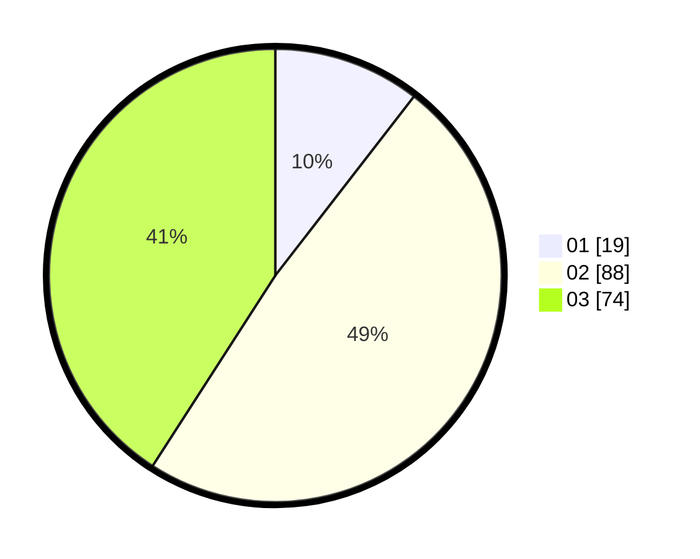

# Hasil

Hasil perolehan suara paslon dapat dilihat pada file paslon-01.txt, paslon-02.txt, dan paslon-03.txt.

Jika tidak ada, artinya data tersebut belum ada pada SIREKAP.

## Perolehan Suara

 * Paslon 01: **19**.
 * Paslon 02: **88**.
 * Paslon 03: **74**.

## Foto C Plano

https://sirekap-obj-formc.kpu.go.id/20f9/pemilu/ppwp/31/75/08/10/02/3175081002061-20240214-155216--78af1bb4-35c9-42fa-8a6c-fefc43b49da5.jpg

https://sirekap-obj-formc.kpu.go.id/20f9/pemilu/ppwp/31/75/08/10/02/3175081002061-20240214-141908--41cdbe92-1139-4937-9cbc-805de60e1b66.jpg

https://sirekap-obj-formc.kpu.go.id/20f9/pemilu/ppwp/31/75/08/10/02/3175081002061-20240214-155205--6019fa95-0403-48f3-bd40-88301b47916d.jpg

## DATA PEMILIH TETAP

Jumlah pemilih dalam DPT: **254**.
 * L: **126**.
 * P: **128**.

## DATA PENGGUNA HAK PILIH

Jumlah pengguna hak pilih dalam DPT: **177**.
 * L: **86**.
 * P: **91**.

Jumlah pengguna hak pilih dalam DPTb: **0**.
 * L: **0**.
 * P: **0**.

Jumlah pengguna hak pilih dalam DPK: **7**.
 * L: **4**.
 * P: **3**.

Jumlah pengguna hak pilih: **184**.
 * L: **90**.
 * P: **94**.

## JUMLAH SUARA SAH DAN TIDAK SAH

JUMLAH SELURUH SUARA SAH: **181**.

JUMLAH SUARA TIDAK SAH: **3**.

JUMLAH SELURUH SUARA SAH DAN SUARA TIDAK SAH: **184**.
