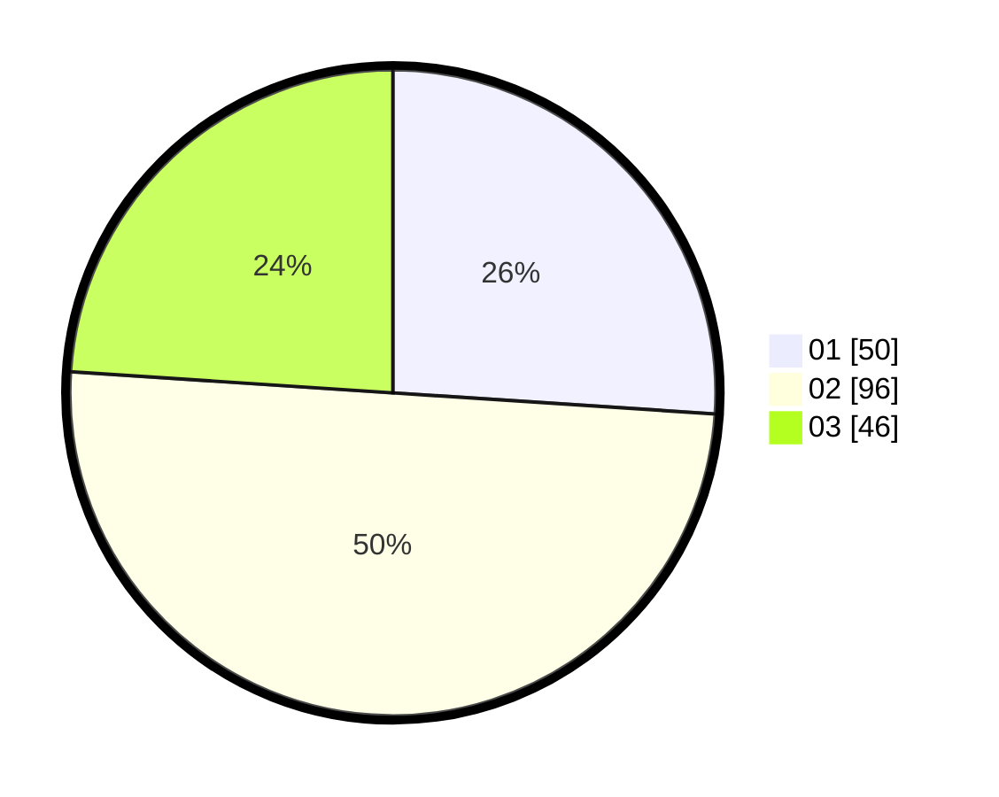

# Hasil

Hasil perolehan suara paslon dapat dilihat pada file paslon-01.txt, paslon-02.txt, dan paslon-03.txt.

Jika tidak ada, artinya data tersebut belum ada pada SIREKAP.

## Perolehan Suara

 * Paslon 01: **50**.
 * Paslon 02: **96**.
 * Paslon 03: **46**.

## Foto C Plano

https://sirekap-obj-formc.kpu.go.id/77d8/pemilu/ppwp/31/75/08/10/02/3175081002066-20240214-224348--9875d8c4-e4d9-4c83-b9eb-e58e547ec7df.jpg

https://sirekap-obj-formc.kpu.go.id/77d8/pemilu/ppwp/31/75/08/10/02/3175081002066-20240214-224441--bcde2fc9-4b05-43ab-939e-0f72f9b07e75.jpg

https://sirekap-obj-formc.kpu.go.id/77d8/pemilu/ppwp/31/75/08/10/02/3175081002066-20240215-010314--ecd4582f-6f69-4ea8-8752-f8a35c545a6f.jpg

## DATA PEMILIH TETAP

Jumlah pemilih dalam DPT: **193**.
 * L: **91**.
 * P: **102**.

## DATA PENGGUNA HAK PILIH

Jumlah pengguna hak pilih dalam DPT: **193**.
 * L: **91**.
 * P: **102**.

Jumlah pengguna hak pilih dalam DPTb: **1**.
 * L: **0**.
 * P: **1**.

Jumlah pengguna hak pilih dalam DPK: **0**.
 * L: **0**.
 * P: **0**.

Jumlah pengguna hak pilih: **193**.
 * L: **91**.
 * P: **102**.

## JUMLAH SUARA SAH DAN TIDAK SAH

JUMLAH SELURUH SUARA SAH: **192**.

JUMLAH SUARA TIDAK SAH: **1**.

JUMLAH SELURUH SUARA SAH DAN SUARA TIDAK SAH: **193**.
