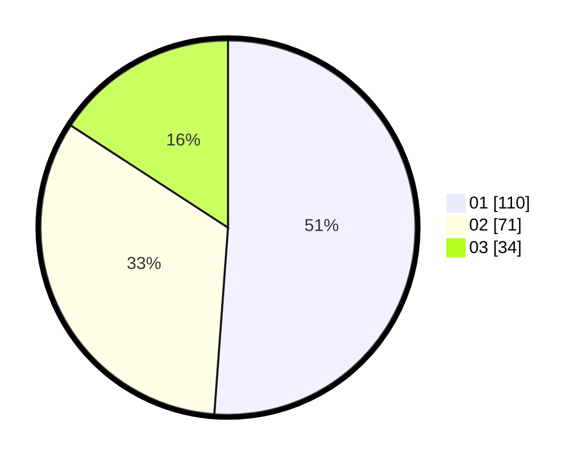

# Hasil

Hasil perolehan suara paslon dapat dilihat pada file paslon-01.txt, paslon-02.txt, dan paslon-03.txt.

Jika tidak ada, artinya data tersebut belum ada pada SIREKAP.

## Perolehan Suara

 * Paslon 01: **110**.
 * Paslon 02: **71**.
 * Paslon 03: **34**.

## Foto C Plano

https://sirekap-obj-formc.kpu.go.id/fc47/pemilu/ppwp/31/75/08/10/02/3175081002076-20240214-193308--2a3bf105-012c-4bb0-b881-fe4ce1027c37.jpg

https://sirekap-obj-formc.kpu.go.id/fc47/pemilu/ppwp/31/75/08/10/02/3175081002076-20240214-193357--de798e1c-b9be-4dbc-840c-f5a99845bc49.jpg

https://sirekap-obj-formc.kpu.go.id/fc47/pemilu/ppwp/31/75/08/10/02/3175081002076-20240214-210027--1f4bd37d-0fdf-431c-bcf8-5a4beef59faa.jpg

## DATA PEMILIH TETAP

Jumlah pemilih dalam DPT: **265**.
 * L: **134**.
 * P: **131**.

## DATA PENGGUNA HAK PILIH

Jumlah pengguna hak pilih dalam DPT: **216**.
 * L: **105**.
 * P: **111**.

Jumlah pengguna hak pilih dalam DPTb: **1**.
 * L: **0**.
 * P: **1**.

Jumlah pengguna hak pilih dalam DPK: **1**.
 * L: **0**.
 * P: **1**.

Jumlah pengguna hak pilih: **218**.
 * L: **105**.
 * P: **113**.

## JUMLAH SUARA SAH DAN TIDAK SAH

JUMLAH SELURUH SUARA SAH: **215**.

JUMLAH SUARA TIDAK SAH: **4**.

JUMLAH SELURUH SUARA SAH DAN SUARA TIDAK SAH: **219**.
