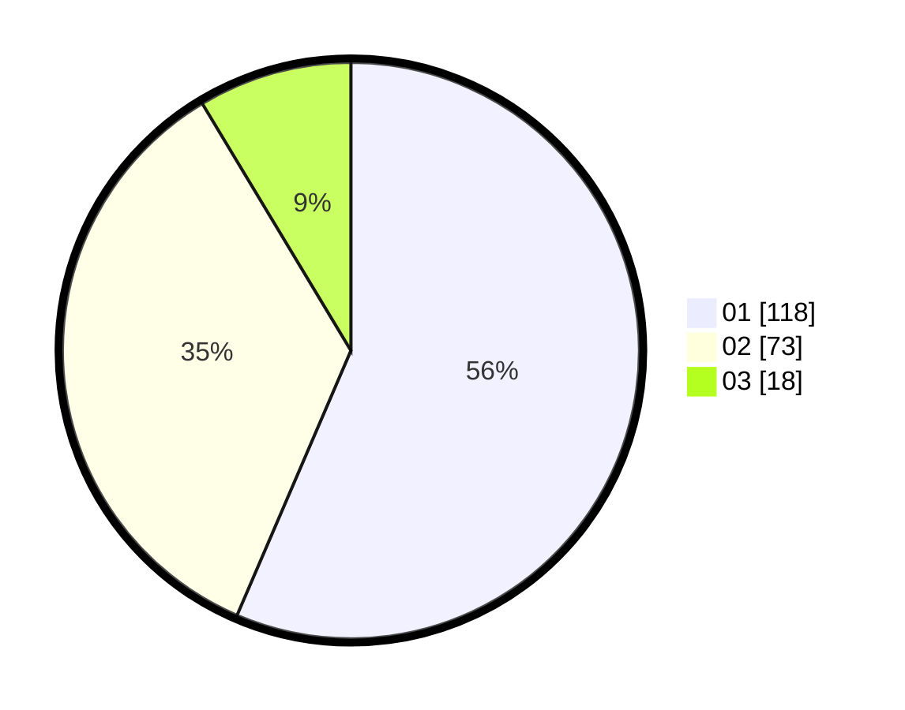

# Hasil

Hasil perolehan suara paslon dapat dilihat pada file paslon-01.txt, paslon-02.txt, dan paslon-03.txt.

Jika tidak ada, artinya data tersebut belum ada pada SIREKAP.

## Perolehan Suara

 * Paslon 01: **118**.
 * Paslon 02: **73**.
 * Paslon 03: **18**.

## Foto C Plano

https://sirekap-obj-formc.kpu.go.id/767d/pemilu/ppwp/31/75/08/10/02/3175081002077-20240214-213231--893c24b7-86fa-4716-b62a-c9b30ba69790.jpg

https://sirekap-obj-formc.kpu.go.id/767d/pemilu/ppwp/31/75/08/10/02/3175081002077-20240214-160115--d6bec9e0-2ce5-4de6-96b6-4f2c0150bbfa.jpg

https://sirekap-obj-formc.kpu.go.id/767d/pemilu/ppwp/31/75/08/10/02/3175081002077-20240214-160119--66e9d6a8-e4de-45dc-9b6d-63dde98b3d9d.jpg
