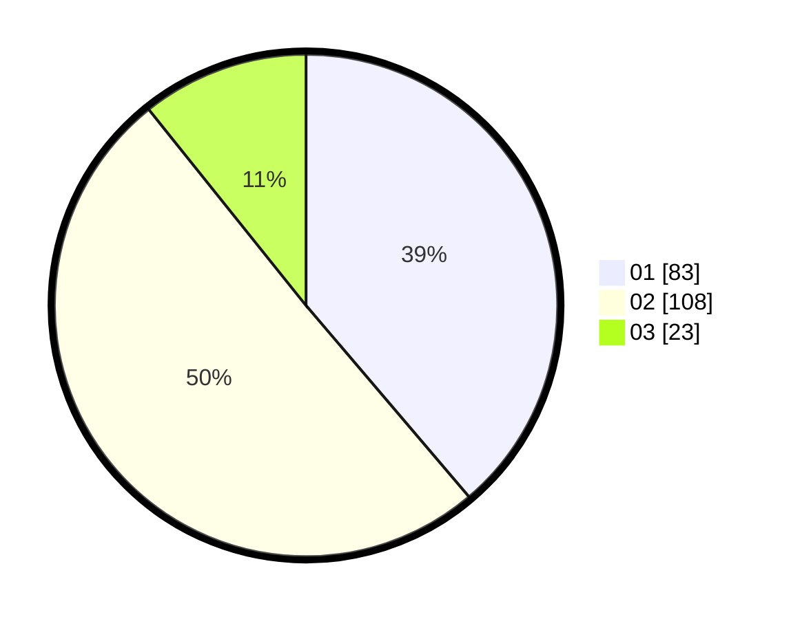

# Hasil

Hasil perolehan suara paslon dapat dilihat pada file paslon-01.txt, paslon-02.txt, dan paslon-03.txt.

Jika tidak ada, artinya data tersebut belum ada pada SIREKAP.

## Perolehan Suara

 * Paslon 01: **83**.
 * Paslon 02: **108**.
 * Paslon 03: **23**.

## Foto C Plano

https://sirekap-obj-formc.kpu.go.id/0722/pemilu/ppwp/31/75/08/10/02/3175081002078-20240215-012326--a2695c28-2688-4b30-ae09-d9e5ab4d5589.jpg

https://sirekap-obj-formc.kpu.go.id/0722/pemilu/ppwp/31/75/08/10/02/3175081002078-20240215-012517--64d80d14-7639-40ff-9929-b2d1fac5e803.jpg

https://sirekap-obj-formc.kpu.go.id/0722/pemilu/ppwp/31/75/08/10/02/3175081002078-20240214-191558--117dbdef-7b7d-4519-b154-0597cb7dde04.jpg
