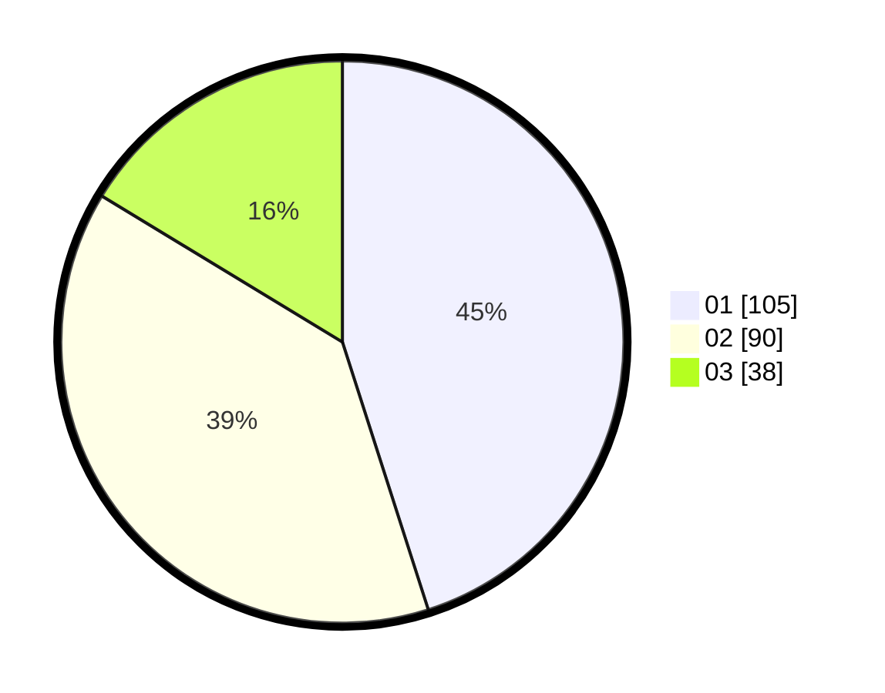

# Hasil

Hasil perolehan suara paslon dapat dilihat pada file paslon-01.txt, paslon-02.txt, dan paslon-03.txt.

Jika tidak ada, artinya data tersebut belum ada pada SIREKAP.

## Perolehan Suara

 * Paslon 01: **105**.
 * Paslon 02: **90**.
 * Paslon 03: **38**.

## Foto C Plano

https://sirekap-obj-formc.kpu.go.id/0961/pemilu/ppwp/31/75/08/10/02/3175081002085-20240214-162239--4fe99d30-15d8-49de-b8fc-44a89b74fa01.jpg

https://sirekap-obj-formc.kpu.go.id/0961/pemilu/ppwp/31/75/08/10/02/3175081002085-20240214-162225--f68a174a-52d1-4ebf-8987-ac9769014288.jpg

https://sirekap-obj-formc.kpu.go.id/0961/pemilu/ppwp/31/75/08/10/02/3175081002085-20240214-160141--e95cbed0-ab51-4662-baf4-c643369673b3.jpg

## DATA PEMILIH TETAP

Jumlah pemilih dalam DPT: **270**.
 * L: **135**.
 * P: **135**.

## DATA PENGGUNA HAK PILIH

Jumlah pengguna hak pilih dalam DPT: **233**.
 * L: **117**.
 * P: **116**.

Jumlah pengguna hak pilih dalam DPTb: **0**.
 * L: **0**.
 * P: **0**.

Jumlah pengguna hak pilih dalam DPK: **3**.
 * L: **1**.
 * P: **2**.

Jumlah pengguna hak pilih: **236**.
 * L: **118**.
 * P: **118**.

## JUMLAH SUARA SAH DAN TIDAK SAH

JUMLAH SELURUH SUARA SAH: **233**.

JUMLAH SUARA TIDAK SAH: **3**.

JUMLAH SELURUH SUARA SAH DAN SUARA TIDAK SAH: **236**.
