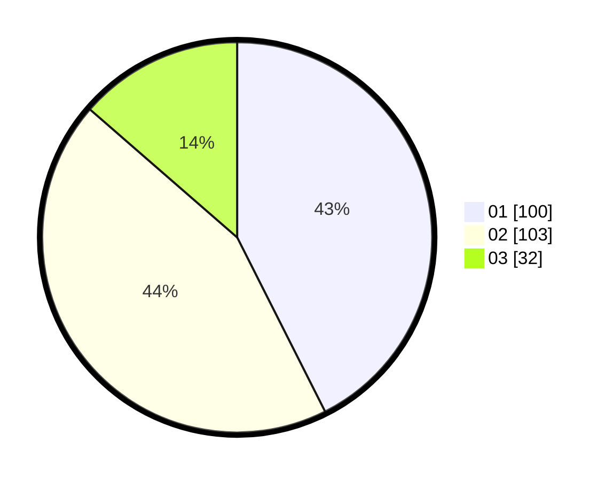

# Hasil

Hasil perolehan suara paslon dapat dilihat pada file paslon-01.txt, paslon-02.txt, dan paslon-03.txt.

Jika tidak ada, artinya data tersebut belum ada pada SIREKAP.

## Perolehan Suara

 * Paslon 01: **100**.
 * Paslon 02: **103**.
 * Paslon 03: **32**.

## Foto C Plano

https://sirekap-obj-formc.kpu.go.id/7f4e/pemilu/ppwp/31/75/08/10/02/3175081002088-20240214-184603--5f91abf2-08d5-4156-af7c-364f4df9c471.jpg

https://sirekap-obj-formc.kpu.go.id/7f4e/pemilu/ppwp/31/75/08/10/02/3175081002088-20240214-184606--653904e0-adcd-4bb9-abc1-86352ec5553a.jpg

https://sirekap-obj-formc.kpu.go.id/7f4e/pemilu/ppwp/31/75/08/10/02/3175081002088-20240214-184611--572385d1-841c-4c24-b11f-695010674b37.jpg

## DATA PEMILIH TETAP

Jumlah pemilih dalam DPT: **267**.
 * L: **130**.
 * P: **137**.

## DATA PENGGUNA HAK PILIH

Jumlah pengguna hak pilih dalam DPT: **223**.
 * L: **101**.
 * P: **122**.

Jumlah pengguna hak pilih dalam DPTb: **12**.
 * L: **8**.
 * P: **4**.

Jumlah pengguna hak pilih dalam DPK: **1**.
 * L: **1**.
 * P: **0**.

Jumlah pengguna hak pilih: **236**.
 * L: **110**.
 * P: **126**.

## JUMLAH SUARA SAH DAN TIDAK SAH

JUMLAH SELURUH SUARA SAH: **235**.

JUMLAH SUARA TIDAK SAH: **1**.

JUMLAH SELURUH SUARA SAH DAN SUARA TIDAK SAH: **236**.
