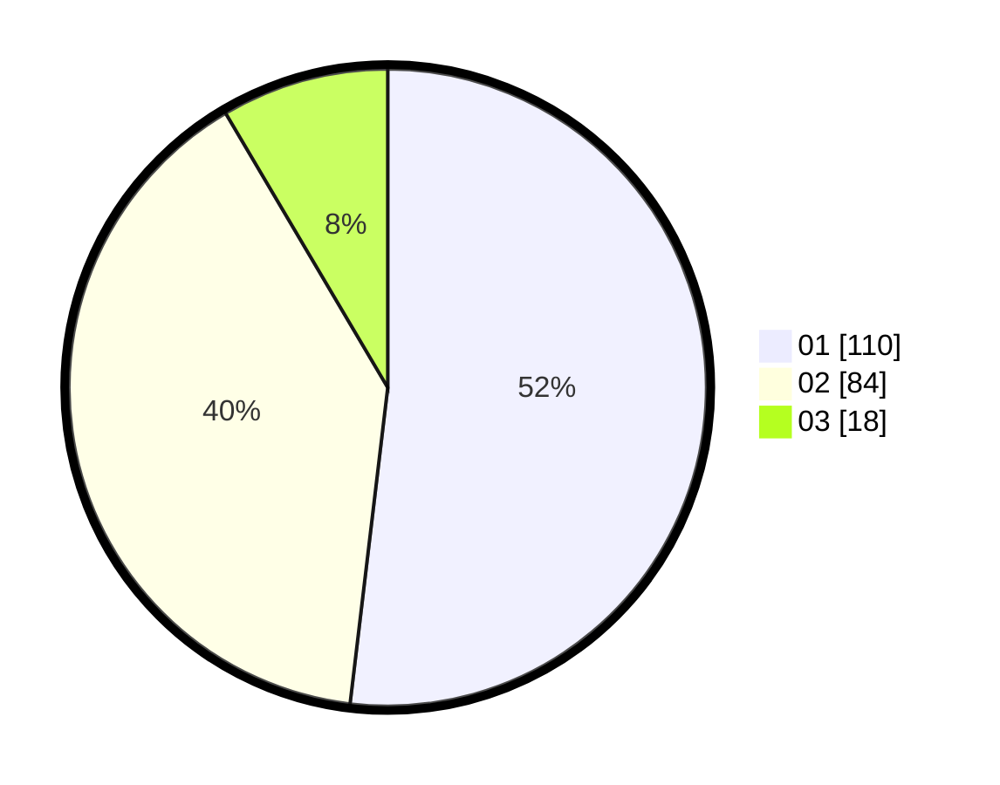

# Hasil

Hasil perolehan suara paslon dapat dilihat pada file paslon-01.txt, paslon-02.txt, dan paslon-03.txt.

Jika tidak ada, artinya data tersebut belum ada pada SIREKAP.

## Perolehan Suara

 * Paslon 01: **110**.
 * Paslon 02: **84**.
 * Paslon 03: **18**.

## Foto C Plano

https://sirekap-obj-formc.kpu.go.id/73a4/pemilu/ppwp/31/75/08/10/03/3175081003002-20240216-113212--457c4ee6-a4bf-43e7-9ce0-a3825cfba09d.jpg

https://sirekap-obj-formc.kpu.go.id/73a4/pemilu/ppwp/31/75/08/10/03/3175081003002-20240216-114342--1059b2c9-800a-40c5-8148-549a5ae257fa.jpg
