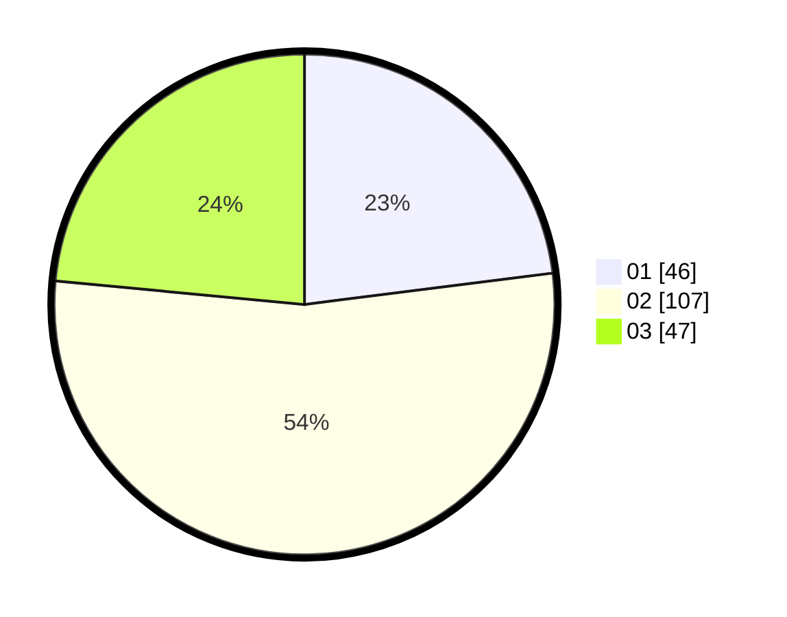

# Hasil

Hasil perolehan suara paslon dapat dilihat pada file paslon-01.txt, paslon-02.txt, dan paslon-03.txt.

Jika tidak ada, artinya data tersebut belum ada pada SIREKAP.

## Perolehan Suara

 * Paslon 01: **46**.
 * Paslon 02: **107**.
 * Paslon 03: **47**.

## Foto C Plano

https://sirekap-obj-formc.kpu.go.id/d7e4/pemilu/ppwp/31/75/08/10/03/3175081003007-20240214-155440--2a35bd0b-cb7b-49f6-8acb-411f28fc98c9.jpg

https://sirekap-obj-formc.kpu.go.id/d7e4/pemilu/ppwp/31/75/08/10/03/3175081003007-20240214-221641--e7414dad-37cc-4a68-a72f-e793189e22f9.jpg

https://sirekap-obj-formc.kpu.go.id/d7e4/pemilu/ppwp/31/75/08/10/03/3175081003007-20240214-195604--a6621f73-6964-48b4-ae18-f46f24e44e6c.jpg

## DATA PEMILIH TETAP

Jumlah pemilih dalam DPT: **258**.
 * L: **126**.
 * P: **132**.

## DATA PENGGUNA HAK PILIH

Jumlah pengguna hak pilih dalam DPT: **200**.
 * L: **97**.
 * P: **103**.

Jumlah pengguna hak pilih dalam DPTb: **2**.
 * L: **1**.
 * P: **1**.

Jumlah pengguna hak pilih dalam DPK: **1**.
 * L: **1**.
 * P: **0**.

Jumlah pengguna hak pilih: **203**.
 * L: **99**.
 * P: **104**.

## JUMLAH SUARA SAH DAN TIDAK SAH

JUMLAH SELURUH SUARA SAH: **200**.

JUMLAH SUARA TIDAK SAH: **3**.

JUMLAH SELURUH SUARA SAH DAN SUARA TIDAK SAH: **203**.
