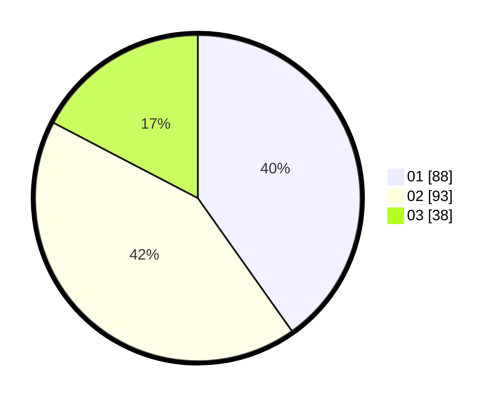

# Hasil

Hasil perolehan suara paslon dapat dilihat pada file paslon-01.txt, paslon-02.txt, dan paslon-03.txt.

Jika tidak ada, artinya data tersebut belum ada pada SIREKAP.

## Perolehan Suara

 * Paslon 01: **88**.
 * Paslon 02: **93**.
 * Paslon 03: **38**.

## Foto C Plano

https://sirekap-obj-formc.kpu.go.id/87ad/pemilu/ppwp/31/75/08/10/03/3175081003008-20240214-224429--d72ea420-5797-43c2-b484-00baf0483993.jpg

https://sirekap-obj-formc.kpu.go.id/87ad/pemilu/ppwp/31/75/08/10/03/3175081003008-20240214-211207--08e91b78-339a-4006-af2d-b312319caa08.jpg

https://sirekap-obj-formc.kpu.go.id/87ad/pemilu/ppwp/31/75/08/10/03/3175081003008-20240214-211254--789c869e-f16d-4873-adec-5b534b7fa48f.jpg
