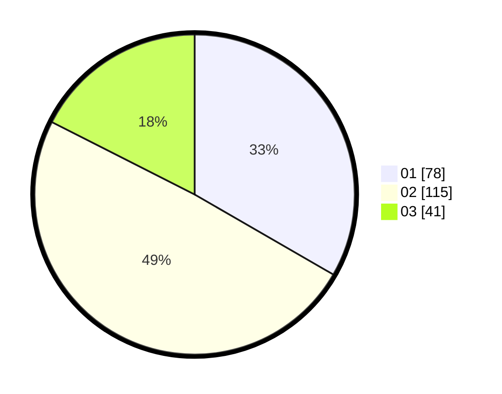

# Hasil

Hasil perolehan suara paslon dapat dilihat pada file paslon-01.txt, paslon-02.txt, dan paslon-03.txt.

Jika tidak ada, artinya data tersebut belum ada pada SIREKAP.

## Perolehan Suara

 * Paslon 01: **78**.
 * Paslon 02: **115**.
 * Paslon 03: **41**.

## Foto C Plano

https://sirekap-obj-formc.kpu.go.id/43c5/pemilu/ppwp/31/75/08/10/03/3175081003009-20240214-221116--817c4479-c722-4368-8ac8-f24f739e0a5c.jpg

https://sirekap-obj-formc.kpu.go.id/43c5/pemilu/ppwp/31/75/08/10/03/3175081003009-20240214-221523--dd12f2d9-0ff9-46d0-a65c-6990900fb0f3.jpg

https://sirekap-obj-formc.kpu.go.id/43c5/pemilu/ppwp/31/75/08/10/03/3175081003009-20240214-221858--2c79d8ef-efed-4db3-84fe-8dd188a879e4.jpg
