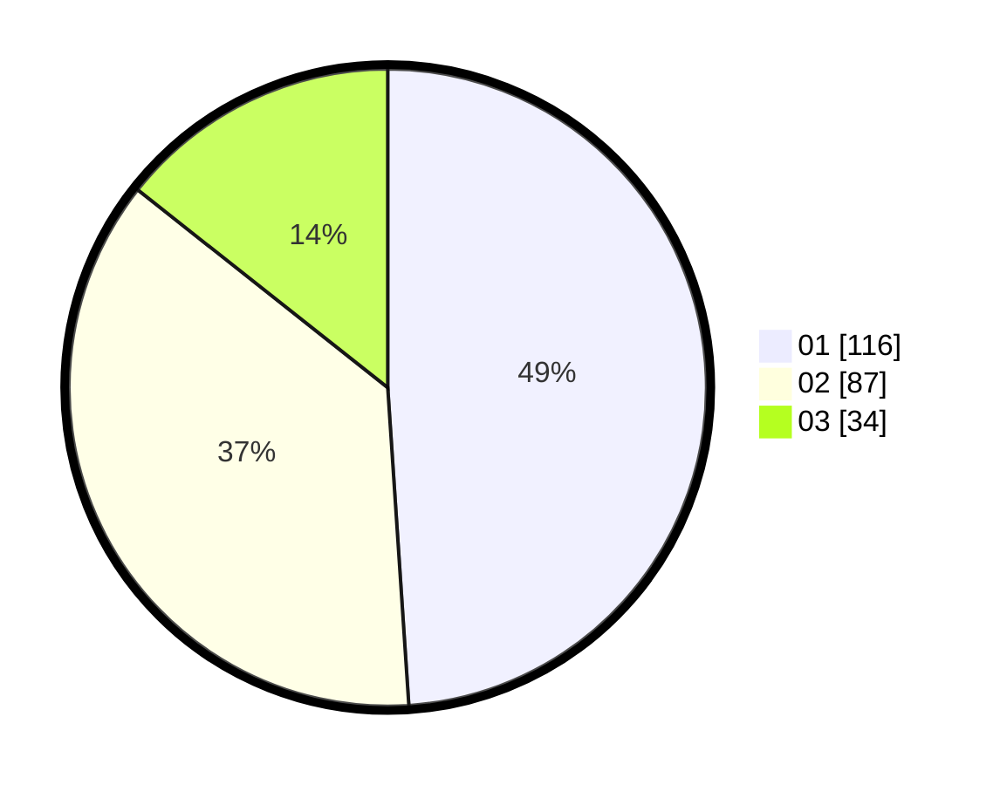

# Hasil

Hasil perolehan suara paslon dapat dilihat pada file paslon-01.txt, paslon-02.txt, dan paslon-03.txt.

Jika tidak ada, artinya data tersebut belum ada pada SIREKAP.

## Perolehan Suara

 * Paslon 01: **116**.
 * Paslon 02: **87**.
 * Paslon 03: **34**.

## Foto C Plano

https://sirekap-obj-formc.kpu.go.id/66bd/pemilu/ppwp/31/75/08/10/03/3175081003016-20240216-133814--6f6339cd-d686-4a79-99fa-462c90ac2499.jpg

https://sirekap-obj-formc.kpu.go.id/66bd/pemilu/ppwp/31/75/08/10/03/3175081003016-20240216-133815--9adb0805-f059-4657-9e4f-e27c64c5cdec.jpg

https://sirekap-obj-formc.kpu.go.id/66bd/pemilu/ppwp/31/75/08/10/03/3175081003016-20240216-133815--0f2f5aaf-9b40-4d58-a28d-e3fdc5f5418c.jpg

## DATA PEMILIH TETAP

Jumlah pemilih dalam DPT: **280**.
 * L: **128**.
 * P: **152**.

## DATA PENGGUNA HAK PILIH

Jumlah pengguna hak pilih dalam DPT: **236**.
 * L: **105**.
 * P: **131**.

Jumlah pengguna hak pilih dalam DPTb: **0**.
 * L: **0**.
 * P: **0**.

Jumlah pengguna hak pilih dalam DPK: **1**.
 * L: **0**.
 * P: **1**.

Jumlah pengguna hak pilih: **237**.
 * L: **105**.
 * P: **132**.

## JUMLAH SUARA SAH DAN TIDAK SAH

JUMLAH SELURUH SUARA SAH: **237**.

JUMLAH SUARA TIDAK SAH: **0**.

JUMLAH SELURUH SUARA SAH DAN SUARA TIDAK SAH: **237**.
