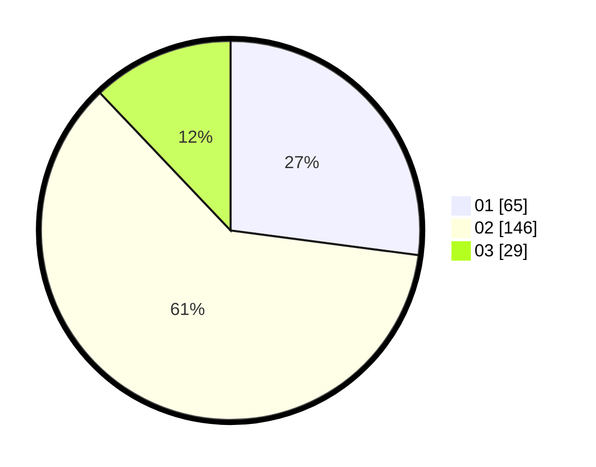

# Hasil

Hasil perolehan suara paslon dapat dilihat pada file paslon-01.txt, paslon-02.txt, dan paslon-03.txt.

Jika tidak ada, artinya data tersebut belum ada pada SIREKAP.

## Perolehan Suara

 * Paslon 01: **65**.
 * Paslon 02: **146**.
 * Paslon 03: **29**.

## Foto C Plano

https://sirekap-obj-formc.kpu.go.id/9a99/pemilu/ppwp/31/75/08/10/03/3175081003017-20240216-124245--b35f49c0-c48e-468d-935f-825697fd9d17.jpg

https://sirekap-obj-formc.kpu.go.id/9a99/pemilu/ppwp/31/75/08/10/03/3175081003017-20240214-222808--8668b1ae-bd0b-4d63-b3ab-dbe641a83107.jpg

https://sirekap-obj-formc.kpu.go.id/9a99/pemilu/ppwp/31/75/08/10/03/3175081003017-20240216-123904--f1c988bb-6af5-4b53-a488-bb8970687741.jpg

## DATA PEMILIH TETAP

Jumlah pemilih dalam DPT: **281**.
 * L: **135**.
 * P: **146**.

## DATA PENGGUNA HAK PILIH

Jumlah pengguna hak pilih dalam DPT: **236**.
 * L: **109**.
 * P: **127**.

Jumlah pengguna hak pilih dalam DPTb: **2**.
 * L: **1**.
 * P: **1**.

Jumlah pengguna hak pilih dalam DPK: **2**.
 * L: **1**.
 * P: **1**.

Jumlah pengguna hak pilih: **240**.
 * L: **111**.
 * P: **129**.

## JUMLAH SUARA SAH DAN TIDAK SAH

JUMLAH SELURUH SUARA SAH: **240**.

JUMLAH SUARA TIDAK SAH: **0**.

JUMLAH SELURUH SUARA SAH DAN SUARA TIDAK SAH: **240**.
