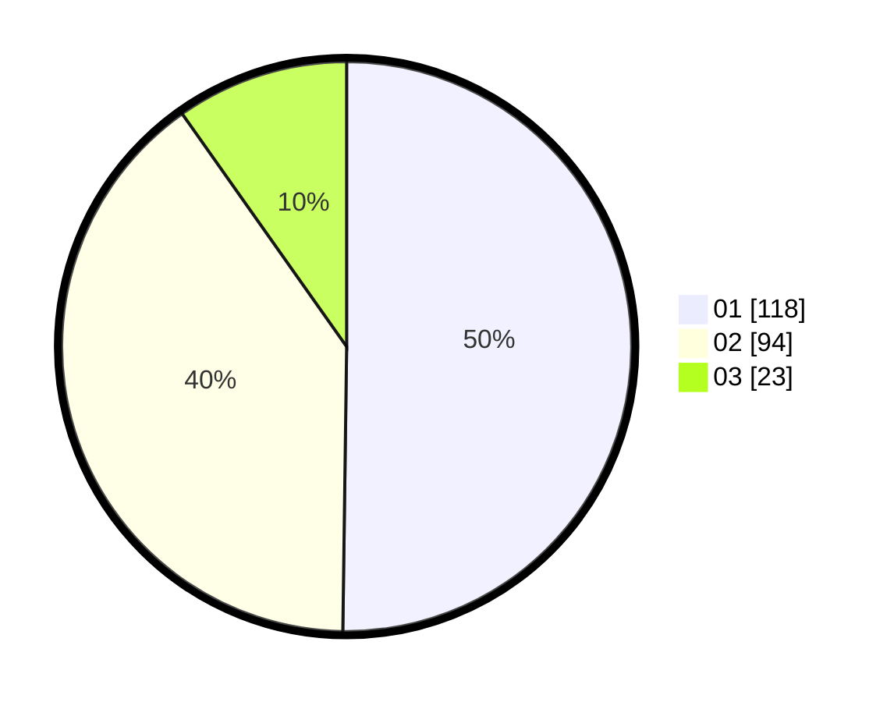

# Hasil

Hasil perolehan suara paslon dapat dilihat pada file paslon-01.txt, paslon-02.txt, dan paslon-03.txt.

Jika tidak ada, artinya data tersebut belum ada pada SIREKAP.

## Perolehan Suara

 * Paslon 01: **118**.
 * Paslon 02: **94**.
 * Paslon 03: **23**.

## Foto C Plano

https://sirekap-obj-formc.kpu.go.id/47f8/pemilu/ppwp/31/75/08/10/03/3175081003022-20240214-213750--e8e978df-7df2-4de3-a965-fa977e919f67.jpg

https://sirekap-obj-formc.kpu.go.id/47f8/pemilu/ppwp/31/75/08/10/03/3175081003022-20240214-213802--18a15a85-09e8-45a2-9740-0a8f864fef4e.jpg

https://sirekap-obj-formc.kpu.go.id/47f8/pemilu/ppwp/31/75/08/10/03/3175081003022-20240214-213812--beebc428-2c16-4699-9859-302d50d8e1e5.jpg
