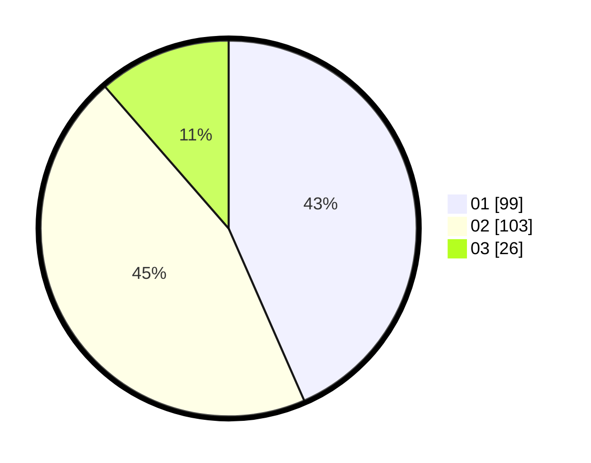

# Hasil

Hasil perolehan suara paslon dapat dilihat pada file paslon-01.txt, paslon-02.txt, dan paslon-03.txt.

Jika tidak ada, artinya data tersebut belum ada pada SIREKAP.

## Perolehan Suara

 * Paslon 01: **99**.
 * Paslon 02: **103**.
 * Paslon 03: **26**.

## Foto C Plano

https://sirekap-obj-formc.kpu.go.id/2298/pemilu/ppwp/31/75/08/10/03/3175081003023-20240215-013319--99ad6003-8d0b-4945-9ed2-3c4417e40a05.jpg

https://sirekap-obj-formc.kpu.go.id/2298/pemilu/ppwp/31/75/08/10/03/3175081003023-20240214-191330--bcdad183-9813-464c-aa2a-50a7053fe522.jpg
