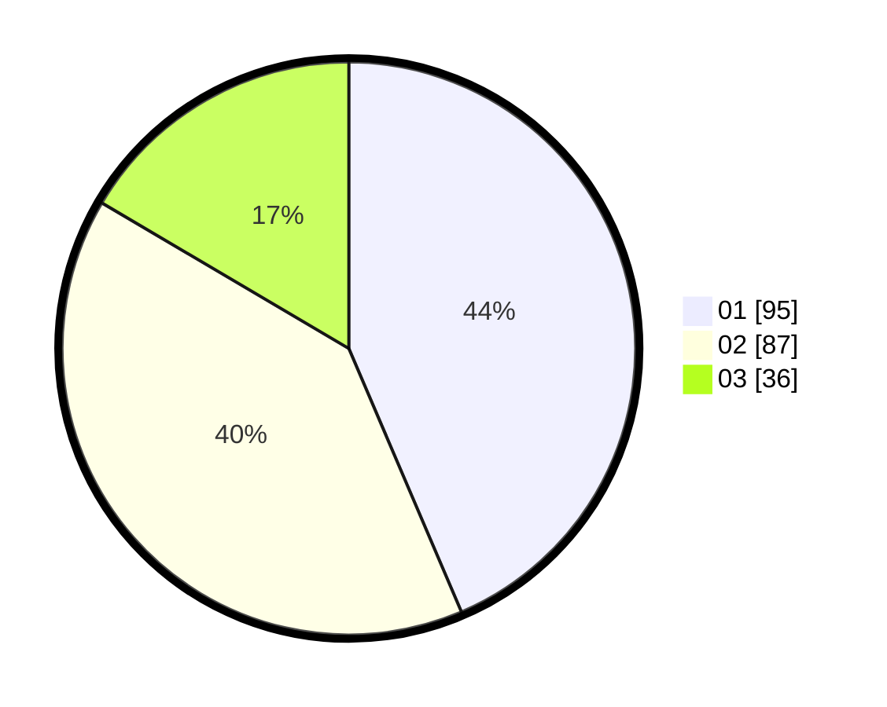

# Hasil

Hasil perolehan suara paslon dapat dilihat pada file paslon-01.txt, paslon-02.txt, dan paslon-03.txt.

Jika tidak ada, artinya data tersebut belum ada pada SIREKAP.

## Perolehan Suara

 * Paslon 01: **95**.
 * Paslon 02: **87**.
 * Paslon 03: **36**.

## Foto C Plano

https://sirekap-obj-formc.kpu.go.id/64cf/pemilu/ppwp/31/75/08/10/03/3175081003026-20240214-191207--1226d123-a63a-4471-8f7b-00aa026e1c50.jpg

https://sirekap-obj-formc.kpu.go.id/64cf/pemilu/ppwp/31/75/08/10/03/3175081003026-20240214-191231--782717c6-e23d-4821-87b7-0b8687857743.jpg

https://sirekap-obj-formc.kpu.go.id/64cf/pemilu/ppwp/31/75/08/10/03/3175081003026-20240214-191250--b708e519-0ca4-4c06-ae7f-1cf773e2dea0.jpg

## DATA PEMILIH TETAP

Jumlah pemilih dalam DPT: **260**.
 * L: **124**.
 * P: **136**.

## DATA PENGGUNA HAK PILIH

Jumlah pengguna hak pilih dalam DPT: **221**.
 * L: **100**.
 * P: **121**.

Jumlah pengguna hak pilih dalam DPTb: **1**.
 * L: **1**.
 * P: **0**.

Jumlah pengguna hak pilih dalam DPK: **1**.
 * L: **0**.
 * P: **1**.

Jumlah pengguna hak pilih: **223**.
 * L: **101**.
 * P: **122**.

## JUMLAH SUARA SAH DAN TIDAK SAH

JUMLAH SELURUH SUARA SAH: **218**.

JUMLAH SUARA TIDAK SAH: **5**.

JUMLAH SELURUH SUARA SAH DAN SUARA TIDAK SAH: **223**.
