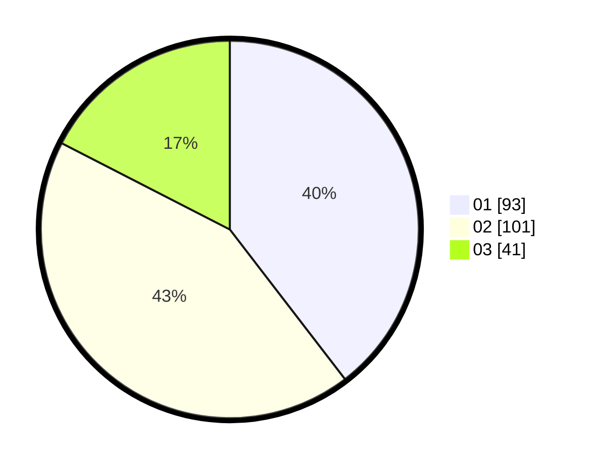

# Hasil

Hasil perolehan suara paslon dapat dilihat pada file paslon-01.txt, paslon-02.txt, dan paslon-03.txt.

Jika tidak ada, artinya data tersebut belum ada pada SIREKAP.

## Perolehan Suara

 * Paslon 01: **93**.
 * Paslon 02: **101**.
 * Paslon 03: **41**.

## Foto C Plano

https://sirekap-obj-formc.kpu.go.id/8164/pemilu/ppwp/31/75/08/10/03/3175081003040-20240214-160056--e47e2cc2-fbc3-437f-84b4-87d432e83de2.jpg

https://sirekap-obj-formc.kpu.go.id/8164/pemilu/ppwp/31/75/08/10/03/3175081003040-20240214-155443--2c52d68c-c93a-498f-b972-c6727abc1d8d.jpg

https://sirekap-obj-formc.kpu.go.id/8164/pemilu/ppwp/31/75/08/10/03/3175081003040-20240214-155609--908b5fe4-46c6-4466-be8b-173970b3a123.jpg
