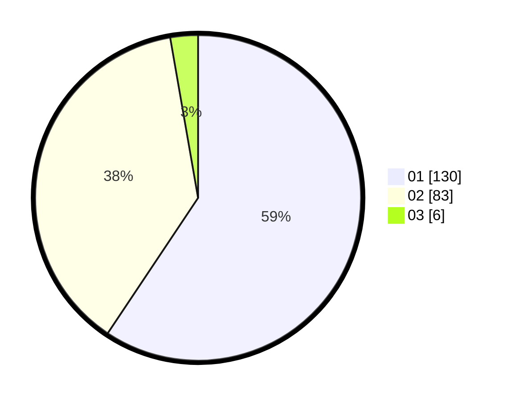

# Hasil

Hasil perolehan suara paslon dapat dilihat pada file paslon-01.txt, paslon-02.txt, dan paslon-03.txt.

Jika tidak ada, artinya data tersebut belum ada pada SIREKAP.

## Perolehan Suara

 * Paslon 01: **130**.
 * Paslon 02: **83**.
 * Paslon 03: **6**.

## Foto C Plano

https://sirekap-obj-formc.kpu.go.id/d192/pemilu/ppwp/31/75/08/10/03/3175081003043-20240214-210138--3d7a335b-e35f-457f-a2de-10d5a0b8f3cb.jpg

https://sirekap-obj-formc.kpu.go.id/d192/pemilu/ppwp/31/75/08/10/03/3175081003043-20240214-200958--0d093cdd-253f-4cd3-91f3-7bc1db71bd79.jpg
