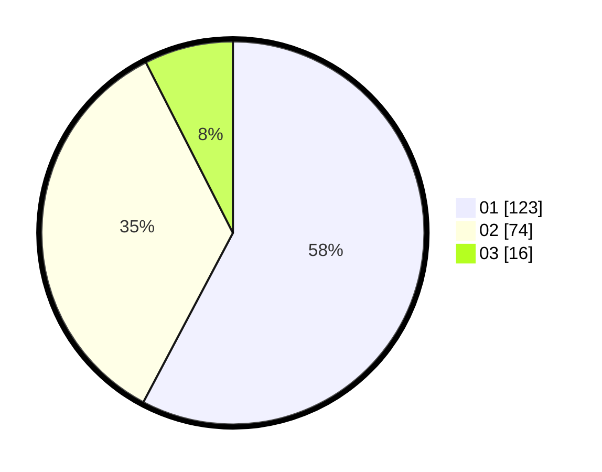

# Hasil

Hasil perolehan suara paslon dapat dilihat pada file paslon-01.txt, paslon-02.txt, dan paslon-03.txt.

Jika tidak ada, artinya data tersebut belum ada pada SIREKAP.

## Perolehan Suara

 * Paslon 01: **123**.
 * Paslon 02: **74**.
 * Paslon 03: **16**.

## Foto C Plano

https://sirekap-obj-formc.kpu.go.id/0e8e/pemilu/ppwp/31/75/08/10/03/3175081003050-20240214-155218--014a9d19-d43a-4bea-8b81-461b08bd68d2.jpg

https://sirekap-obj-formc.kpu.go.id/0e8e/pemilu/ppwp/31/75/08/10/03/3175081003050-20240214-155254--d7ef96c5-b097-4de3-8070-eae497c57f6a.jpg

https://sirekap-obj-formc.kpu.go.id/0e8e/pemilu/ppwp/31/75/08/10/03/3175081003050-20240214-155331--452e55ae-f979-41d7-9ff3-95c64f2e6234.jpg

## DATA PEMILIH TETAP

Jumlah pemilih dalam DPT: **212**.
 * L: **106**.
 * P: **106**.

## DATA PENGGUNA HAK PILIH

Jumlah pengguna hak pilih dalam DPT: **212**.
 * L: **106**.
 * P: **106**.

Jumlah pengguna hak pilih dalam DPTb: **2**.
 * L: **1**.
 * P: **1**.

Jumlah pengguna hak pilih dalam DPK: **2**.
 * L: **1**.
 * P: **1**.

Jumlah pengguna hak pilih: **216**.
 * L: **108**.
 * P: **108**.

## JUMLAH SUARA SAH DAN TIDAK SAH

JUMLAH SELURUH SUARA SAH: **213**.

JUMLAH SUARA TIDAK SAH: **3**.

JUMLAH SELURUH SUARA SAH DAN SUARA TIDAK SAH: **216**.
