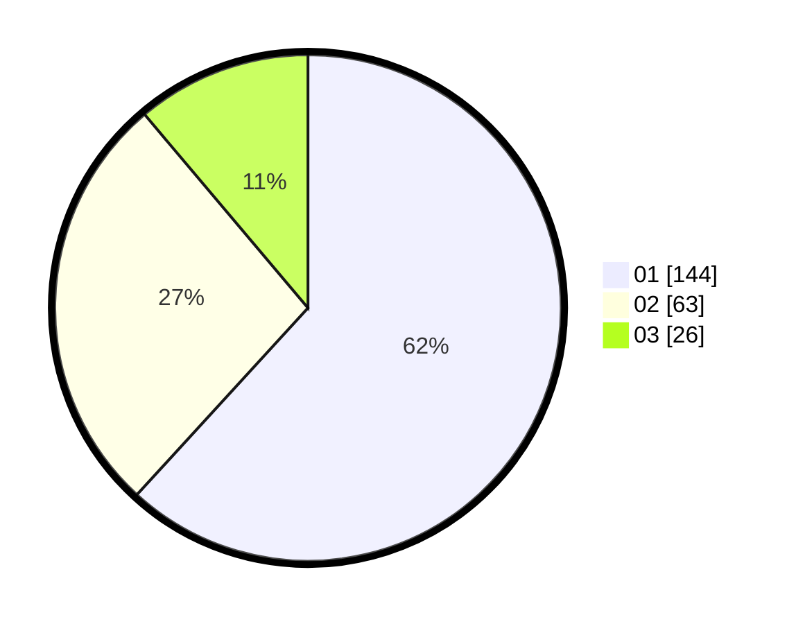

# Hasil

Hasil perolehan suara paslon dapat dilihat pada file paslon-01.txt, paslon-02.txt, dan paslon-03.txt.

Jika tidak ada, artinya data tersebut belum ada pada SIREKAP.

## Perolehan Suara

 * Paslon 01: **144**.
 * Paslon 02: **63**.
 * Paslon 03: **26**.

## Foto C Plano

https://sirekap-obj-formc.kpu.go.id/7e90/pemilu/ppwp/31/75/08/10/03/3175081003051-20240214-225335--6256ac15-1c7f-4056-a3f1-b13a49dd77d8.jpg

https://sirekap-obj-formc.kpu.go.id/7e90/pemilu/ppwp/31/75/08/10/03/3175081003051-20240214-194926--be0507da-a81e-49a6-bef5-4cc1cdc34995.jpg

https://sirekap-obj-formc.kpu.go.id/7e90/pemilu/ppwp/31/75/08/10/03/3175081003051-20240214-225142--50a26328-9417-4a87-8c57-14321193217f.jpg
