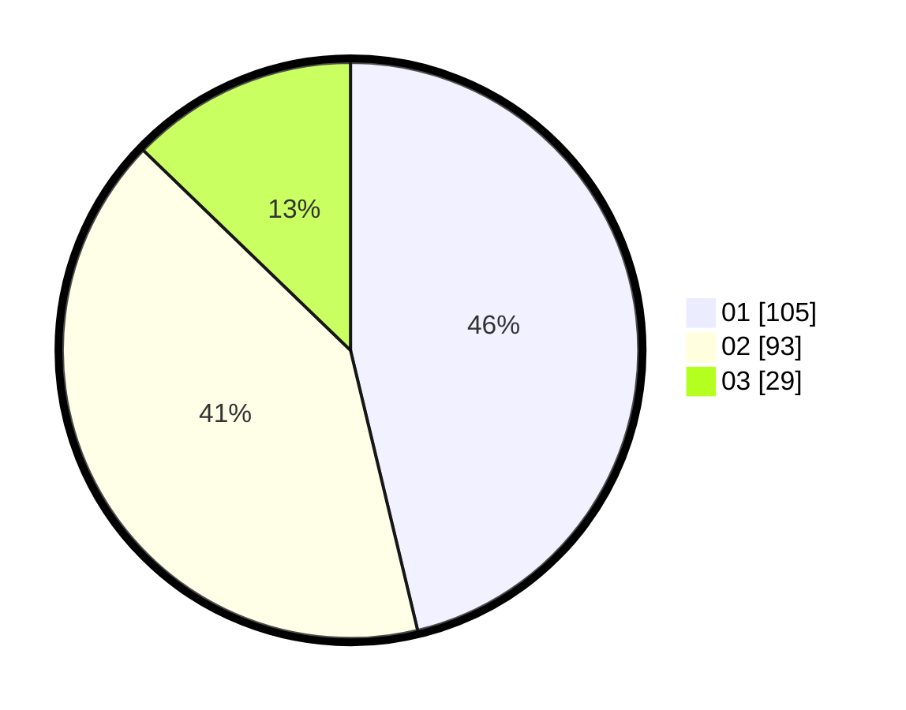

# Hasil

Hasil perolehan suara paslon dapat dilihat pada file paslon-01.txt, paslon-02.txt, dan paslon-03.txt.

Jika tidak ada, artinya data tersebut belum ada pada SIREKAP.

## Perolehan Suara

 * Paslon 01: **105**.
 * Paslon 02: **93**.
 * Paslon 03: **29**.

## Foto C Plano

https://sirekap-obj-formc.kpu.go.id/22d9/pemilu/ppwp/31/75/08/10/03/3175081003054-20240214-185542--ff2e0230-68dd-4c57-92e2-37e2025db988.jpg

https://sirekap-obj-formc.kpu.go.id/22d9/pemilu/ppwp/31/75/08/10/03/3175081003054-20240214-160121--b3a12db6-a6e0-44fc-96b1-1576efe6d4b8.jpg

https://sirekap-obj-formc.kpu.go.id/22d9/pemilu/ppwp/31/75/08/10/03/3175081003054-20240214-155516--8b868603-f056-415b-baf9-5cd069900958.jpg

## DATA PEMILIH TETAP

Jumlah pemilih dalam DPT: **269**.
 * L: **131**.
 * P: **138**.

## DATA PENGGUNA HAK PILIH

Jumlah pengguna hak pilih dalam DPT: **228**.
 * L: **106**.
 * P: **122**.

Jumlah pengguna hak pilih dalam DPTb: **2**.
 * L: **1**.
 * P: **1**.

Jumlah pengguna hak pilih dalam DPK: **0**.
 * L: **0**.
 * P: **0**.

Jumlah pengguna hak pilih: **230**.
 * L: **107**.
 * P: **123**.

## JUMLAH SUARA SAH DAN TIDAK SAH

JUMLAH SELURUH SUARA SAH: **227**.

JUMLAH SUARA TIDAK SAH: **3**.

JUMLAH SELURUH SUARA SAH DAN SUARA TIDAK SAH: **230**.
