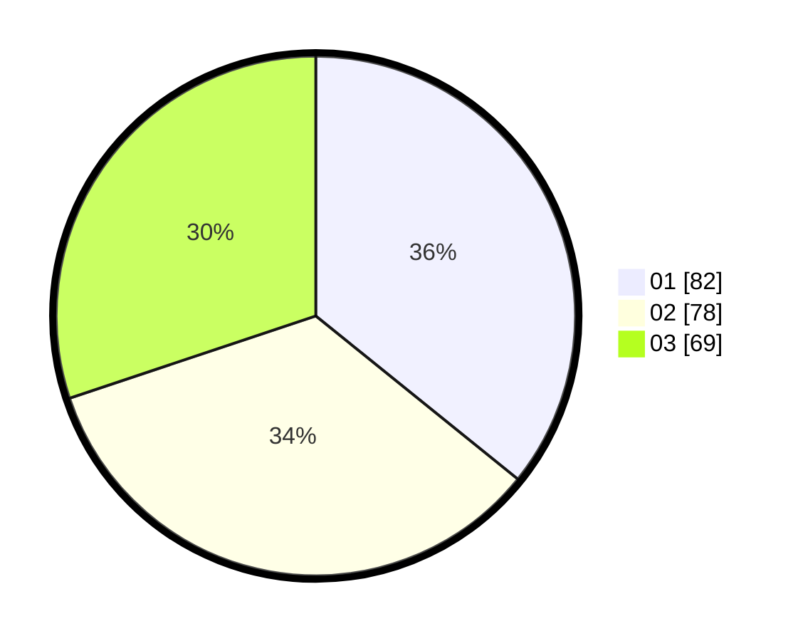

# Hasil

Hasil perolehan suara paslon dapat dilihat pada file paslon-01.txt, paslon-02.txt, dan paslon-03.txt.

Jika tidak ada, artinya data tersebut belum ada pada SIREKAP.

## Perolehan Suara

 * Paslon 01: **82**.
 * Paslon 02: **78**.
 * Paslon 03: **69**.

## Foto C Plano

https://sirekap-obj-formc.kpu.go.id/d83d/pemilu/ppwp/31/75/08/10/03/3175081003061-20240214-215102--343401e3-b9a3-45aa-b1b6-6f6dda061b8e.jpg

https://sirekap-obj-formc.kpu.go.id/d83d/pemilu/ppwp/31/75/08/10/03/3175081003061-20240215-102018--4649a4ae-d515-41a6-8d1d-c591722c0b53.jpg

https://sirekap-obj-formc.kpu.go.id/d83d/pemilu/ppwp/31/75/08/10/03/3175081003061-20240215-102035--3fb478f2-4da9-48d2-b434-c5b889079401.jpg
