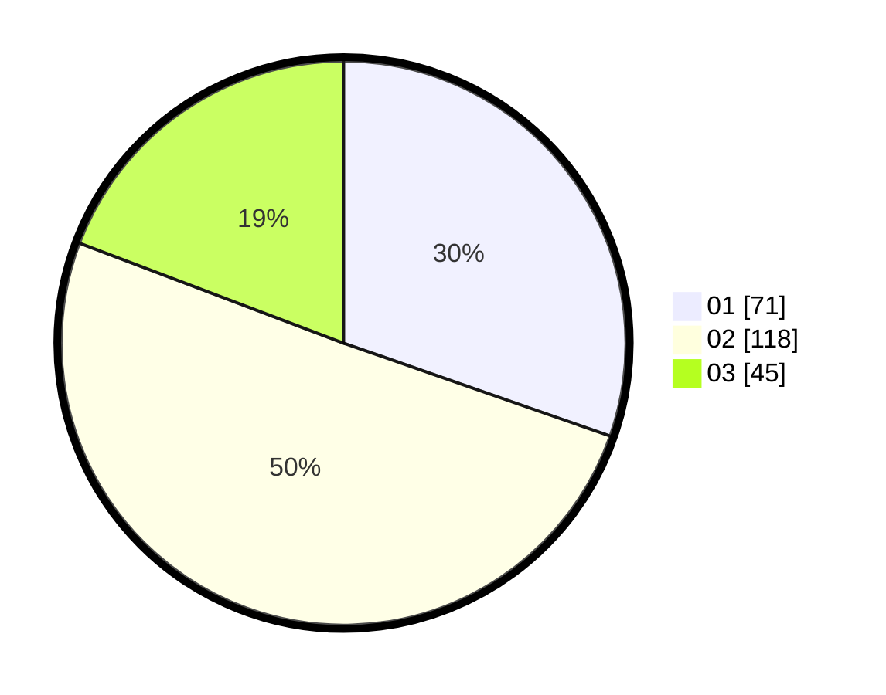

# Hasil

Hasil perolehan suara paslon dapat dilihat pada file paslon-01.txt, paslon-02.txt, dan paslon-03.txt.

Jika tidak ada, artinya data tersebut belum ada pada SIREKAP.

## Perolehan Suara

 * Paslon 01: **71**.
 * Paslon 02: **118**.
 * Paslon 03: **45**.

## Foto C Plano

https://sirekap-obj-formc.kpu.go.id/1698/pemilu/ppwp/31/75/08/10/03/3175081003065-20240214-191520--d2007ffe-bce7-43d0-86c8-bcc82365e48e.jpg

https://sirekap-obj-formc.kpu.go.id/1698/pemilu/ppwp/31/75/08/10/03/3175081003065-20240214-191525--7d3388c8-5bba-4dc8-aaf6-e8ee0527e582.jpg

https://sirekap-obj-formc.kpu.go.id/1698/pemilu/ppwp/31/75/08/10/03/3175081003065-20240215-010301--e33e4113-c23d-4e3f-ab24-58579ba7ca4b.jpg
