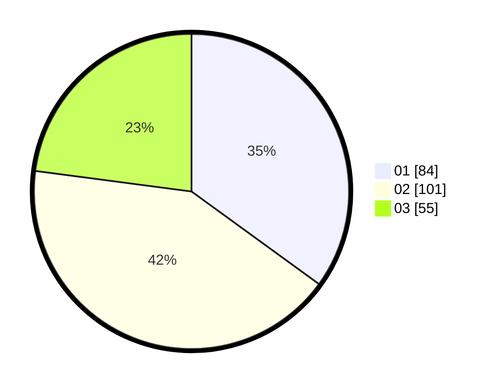

# Hasil

Hasil perolehan suara paslon dapat dilihat pada file paslon-01.txt, paslon-02.txt, dan paslon-03.txt.

Jika tidak ada, artinya data tersebut belum ada pada SIREKAP.

## Perolehan Suara

 * Paslon 01: **84**.
 * Paslon 02: **101**.
 * Paslon 03: **55**.

## Foto C Plano

https://sirekap-obj-formc.kpu.go.id/8297/pemilu/ppwp/31/75/08/10/03/3175081003087-20240215-030207--99441ff0-ce7b-4b56-a75e-bc7edf3d4dde.jpg

https://sirekap-obj-formc.kpu.go.id/8297/pemilu/ppwp/31/75/08/10/03/3175081003087-20240215-030357--28f37b8b-2101-4315-934f-4907062d7cf7.jpg

https://sirekap-obj-formc.kpu.go.id/8297/pemilu/ppwp/31/75/08/10/03/3175081003087-20240215-030853--6a3b6973-7965-4736-84b4-6a515566226d.jpg
